# 常见蜜罐体验和探索

## 实验目的

了解蜜罐的分类和基本原理 
了解不同类型蜜罐的适用场合 
掌握常见蜜罐的搭建和使用 

## 实验环境

从 paralax/awesome-honeypots 中选择 1 种低交互蜜罐和 1 种中等交互蜜罐进行搭建实验 
推荐 SSH 蜜罐 
VM1:192.168.56.101：进行蜜罐部署 
VM2:192.168.56.102：进行ssh连接和攻击 

## 实验要求

记录蜜罐的详细搭建过程； 
使用 nmap 扫描搭建好的蜜罐并分析扫描结果，同时分析「 nmap 扫描期间」蜜罐上记录得到的信息； 
如何辨别当前目标是一个「蜜罐」？以自己搭建的蜜罐为例进行说明； 
（可选）总结常见的蜜罐识别和检测方法； 
（可选）基于 canarytokens 搭建蜜信实验环境进行自由探索型实验； 

## 实验内容

选择ssh蜜罐 
[低交互蜜罐选择sshlowpot](https://github.com/magisterquis/sshlowpot) 
[中等交互蜜罐选择cowrie](https://github.com/cowrie/cowrie) 

### (1)低交互蜜罐

__gitclone__ 

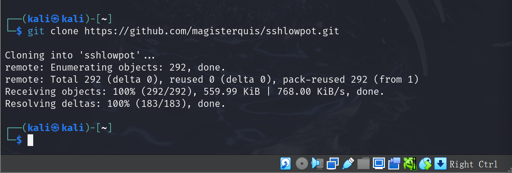 

__这个蜜罐基于go语言开发，先安装依赖__ 
由于这是一个外网，所以需要先将其改为一个国内网站再进行安装 

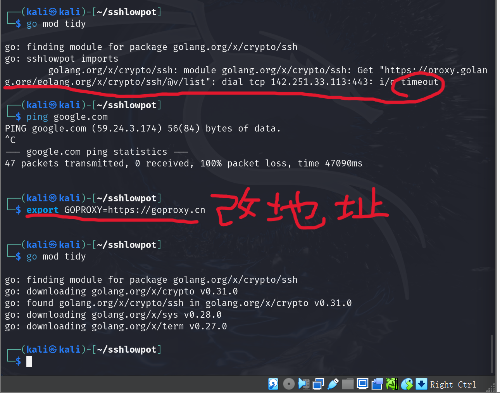 

__试运行蜜罐__ 

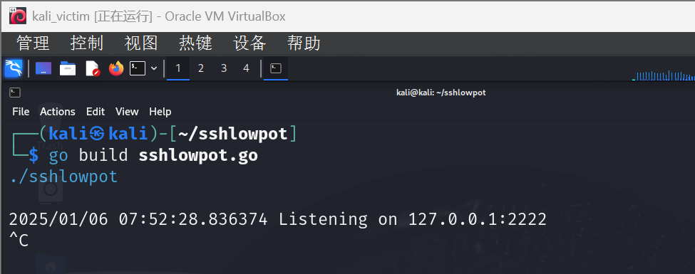 
发现蜜罐的监听端口是2222

__编译并运行蜜罐__ 

先打开ssh服务,在第一次尝试ssh连接时发现无法连接,发现是蜜罐自身配置问题导致只能2222端口只能接受本机的访问 
修改源文件sshlowpot.go，改为0.0.0.0:2222 
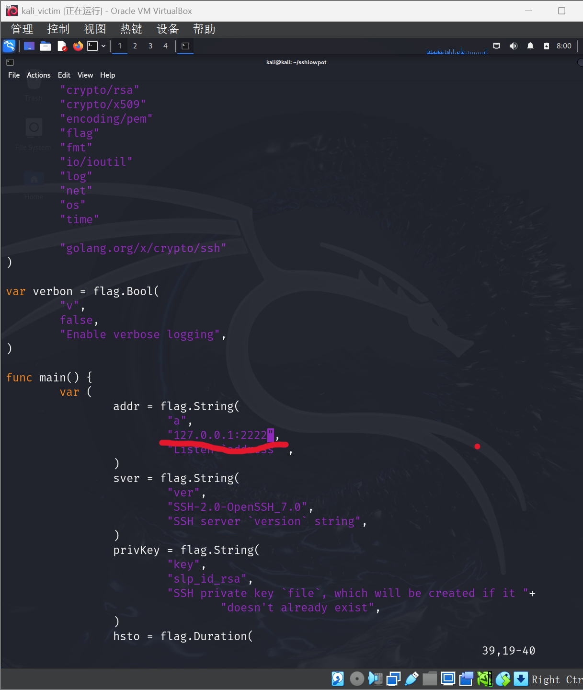 

__再次尝试连接__ 
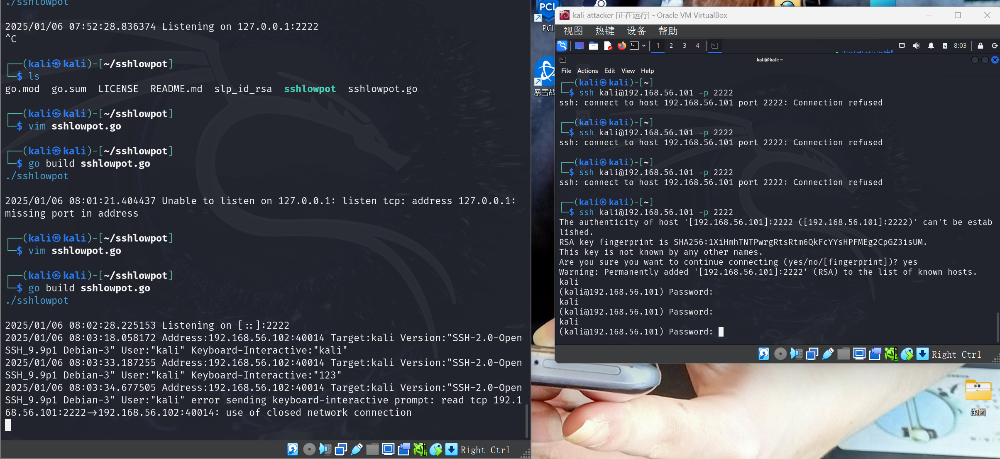 
蜜罐信息中，第一次输入了正确密码"kali"，第二次输入了错误密码"123"，然后关闭了连接 
与实际操作相同 

### (2)中等交互蜜罐

__gitclone__ 

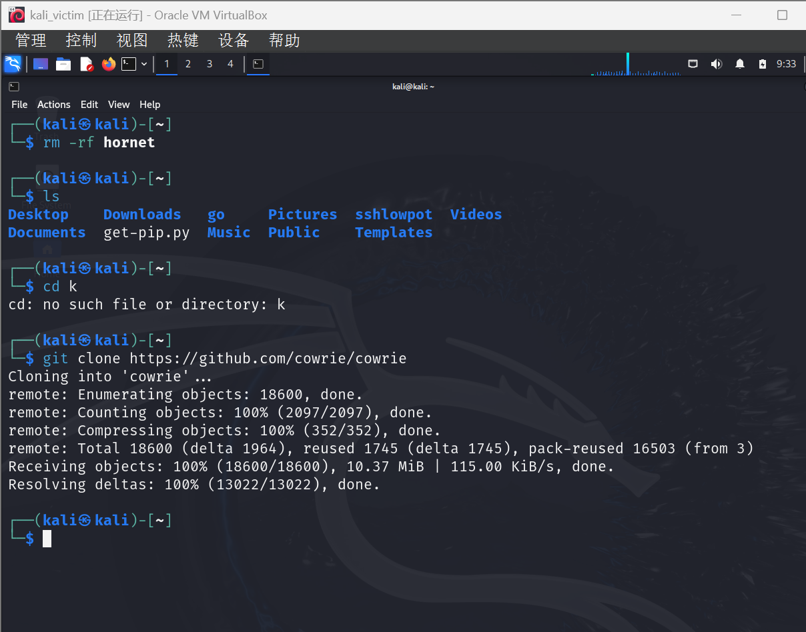 

__安装前置辅助__ 

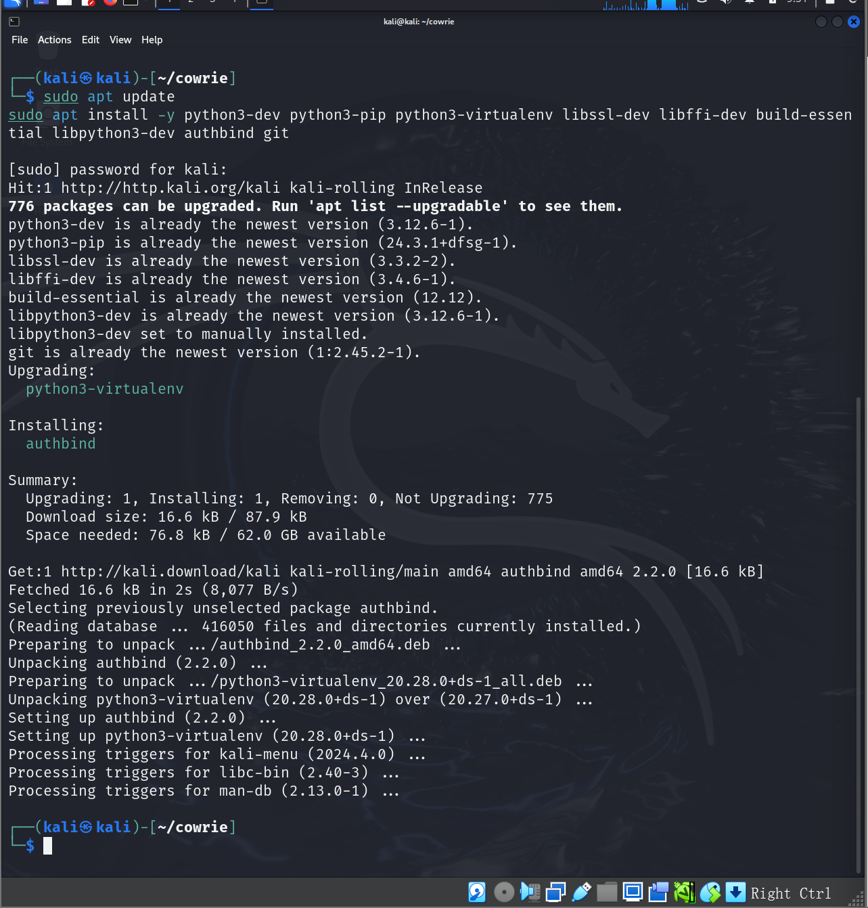 

__安装需求环境__ 

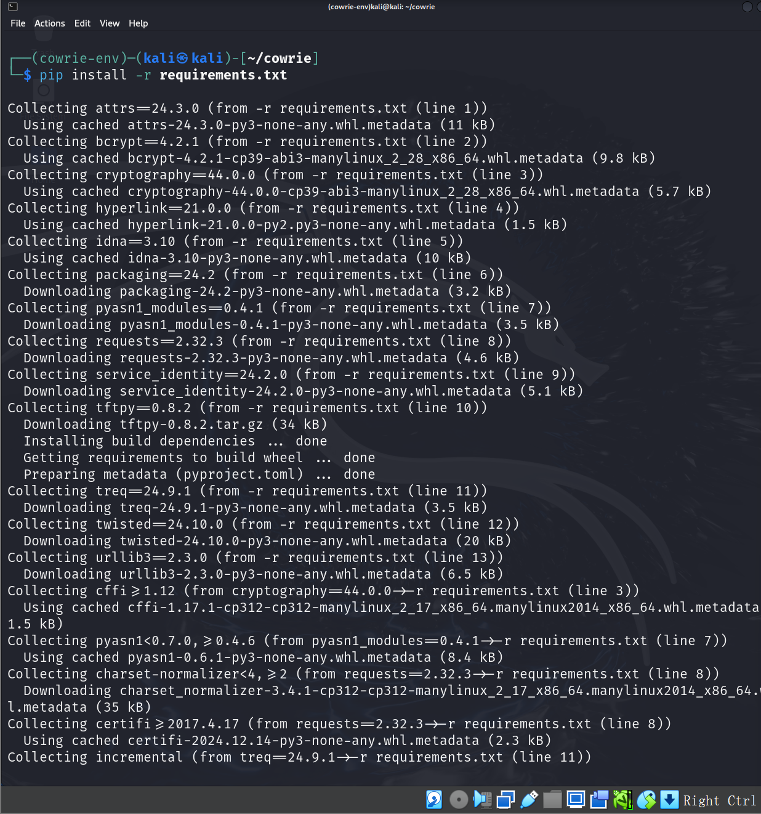 

__建立虚拟环境__ 

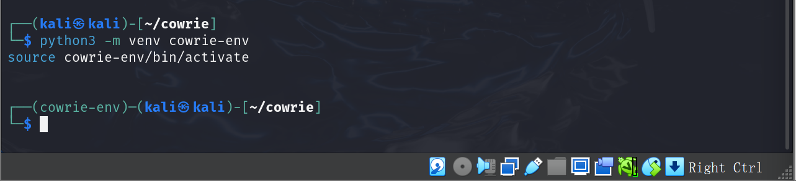 

__运行__ 

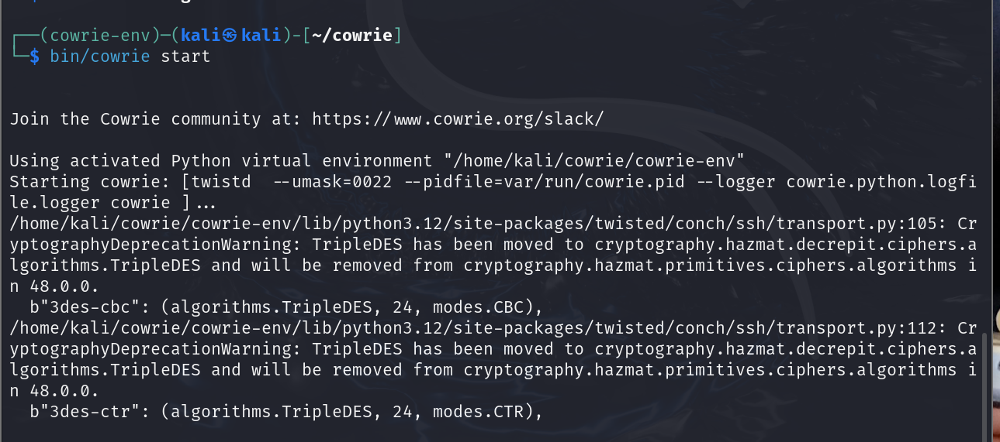 

__备份一份config文件__ 

因为可能需要修改config 
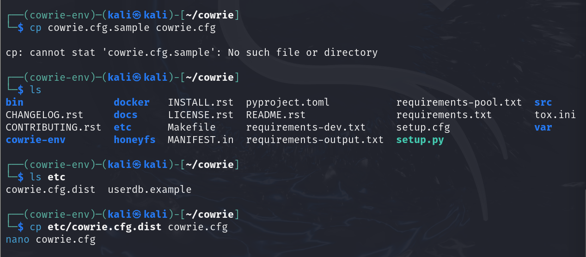 

__用另一台虚拟机进行ssh连接尝试__ 

经舍友提醒，发现有两种连接方式，一种是直接连接kali这个用户
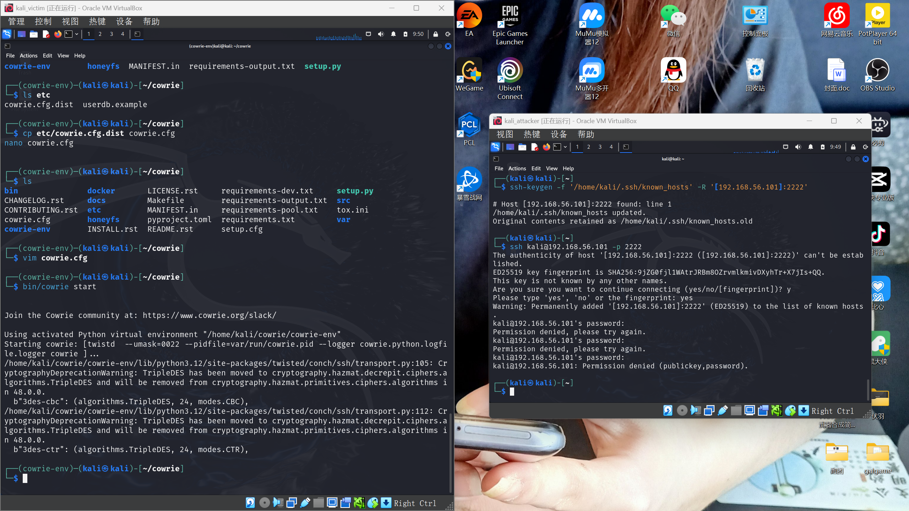 
第二种是连接root这个用户 
 

__分析蜜罐日志__ 

在/var/log/cowrie/cowrie.log中可以看到日志 
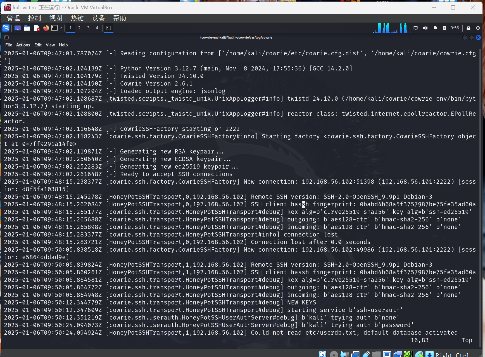 
图1 
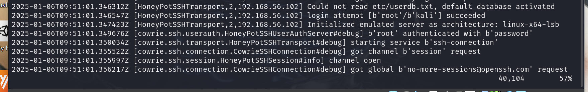 
图2 
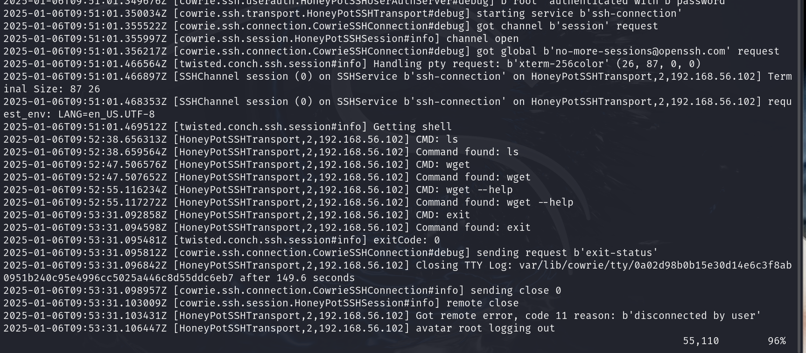 
图3 
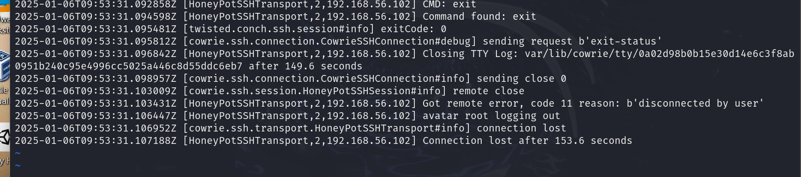 
图4 

1.在图1中可以看见，我们打开蜜罐，读取了config文件中的配置并且启动了服务。 
  然后收到了来自VM2的一个连接并且很快关闭。其后，收到了第二次连接请求，并且输入了kali这个用户名和密码。 
2.在图2中，我们尝试了几个密码，然后因为尝试次数过多而关闭连接。很快又收到了下一个连接请求，这次输入了root的用户名和密码。 
3.在图3中，我们看见在这个米观众运行了ls、wget、wget --help这几个命令，最后用exit退出了。 
4.在图4中，蜜罐关闭了TTY log文件，输出了运行时间；关闭了连接，并且输出了运行时间。 

## 思考
1.如何辨别当前目标是一个「蜜罐」？以自己搭建的蜜罐为例进行说明； 
在连接root用户后，使用wget --help这个命令之后的输出“unrecognized option”这是一个python输出，所以是蜜罐