# 实验 Snort

## 安装

禁止在apt安装时弹出交互式配置界面 
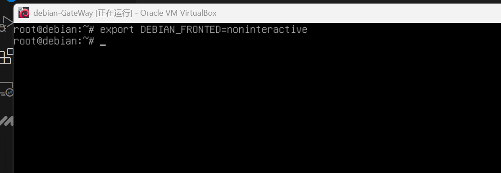 
安装snort 
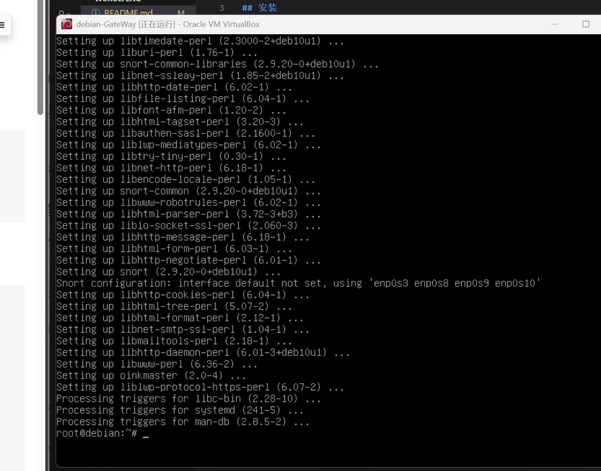 

## 实验一：配置snort为嗅探模式

__显示IP/TCP/UDP/ICMP头__

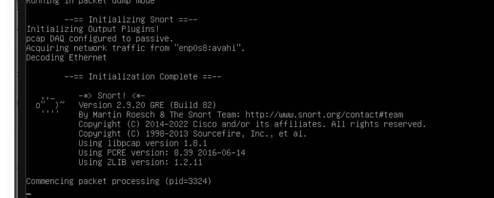

__显示应用层数据__

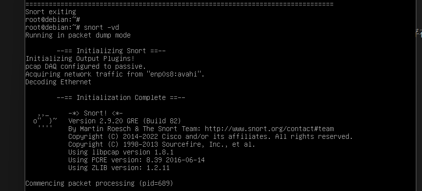

__显示数据链路层报文头__

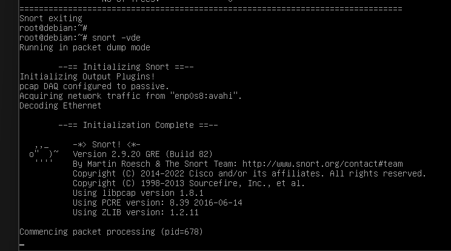

## 实验二：配置并启用snort内置规则

配置snort.conf 
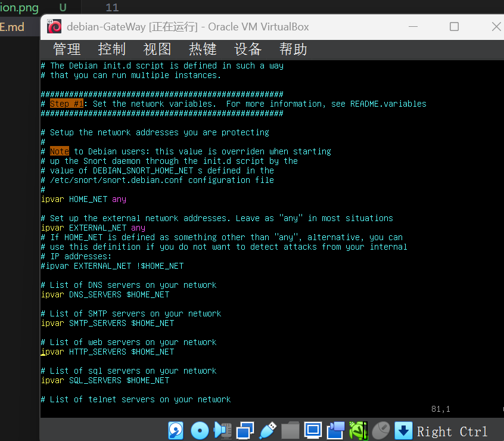 
启用配置 
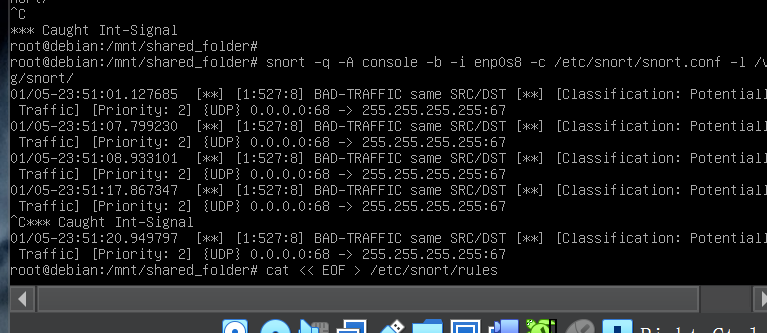 

其后通过snort -q -A console -b -i enp0s3 -c /etc/snort/snort.conf -l /var/log/snort/启用(该虚拟机没有eth1这张网卡，换为enp0s3)

## 实验三：自定义snort规则

新建自定义规则文件之后，添加配置代码到/etc/snort/snort.conf 
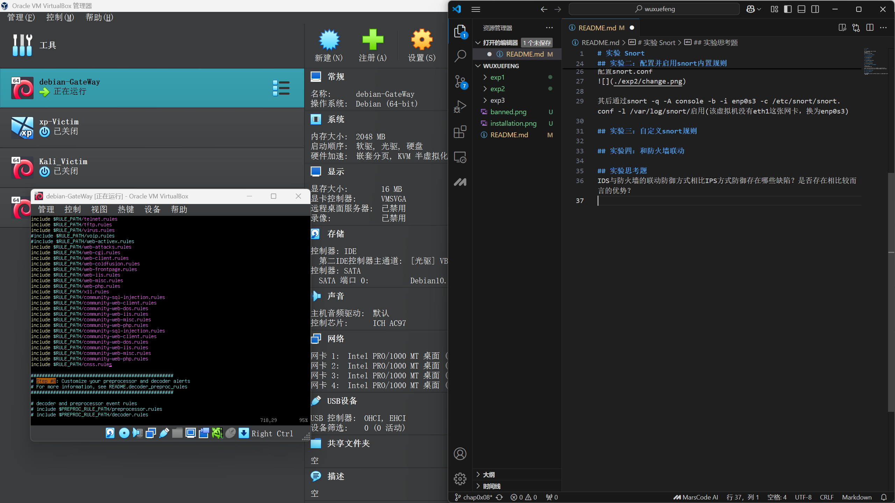 

使用snort -q -A fast -b -i enp0s3 -c /etc/snort/snort.conf -l /var/log/snort/启用配置

## 实验四：和防火墙联动

安装nmap 
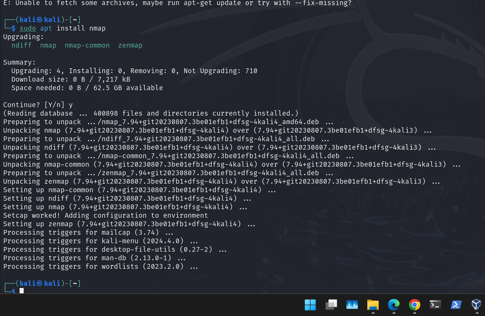 
解压 
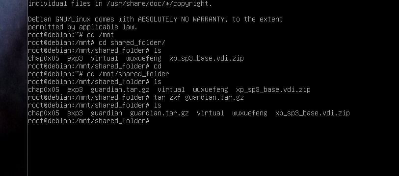 
结果 
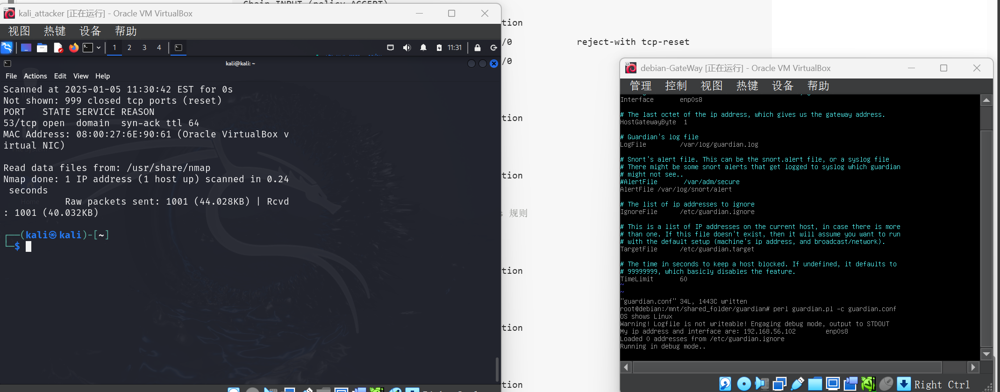 

## 实验思考题
IDS与防火墙的联动防御方式相比IPS方式防御存在哪些缺陷？是否存在相比较而言的优势？

缺陷： 
响应延迟：IDS需要先检测攻击，然后依赖防火墙调整策略，存在响应延迟，攻击可能持续更长时间。 
无法主动阻止攻击：IDS本身不能阻止攻击，只能告警并依赖防火墙防御，缺乏主动防御能力。 
误报和漏报：IDS可能误报或漏报攻击，导致防火墙采取错误的措施或无法及时防御。 
复杂的配置与管理：IDS与防火墙的联动需要额外的配置和协调，增加了系统管理的复杂性。 
可能被绕过：攻击者可能通过一些技巧（如加密流量）绕过IDS的检测，防火墙也未必能阻止所有类型的攻击。 

优势： 
低影响和高可用性：由于IDS是被动监控系统，不会直接干扰正常流量，因此不会因为误报导致合法流量的中断，适合高可用性要求较高的环境。 
详细的日志和事件记录：IDS不仅能检测攻击，还能记录详细的网络活动日志，这有助于事后分析、追溯攻击来源，提供更深入的安全审计。 
灵活性：IDS可以与多个不同的防火墙或安全设备联动，根据攻击的性质采取不同的防御策略，因此在多样化的环境中具有较好的适应性。 
误报处理较轻：IDS的被动性意味着它不会自动做出任何决策或拦截，这使得误报对系统业务的影响较小。相比之下，IPS误报可能会导致正常流量的误封。 
对新的攻击形式有更好的适应性：IDS可以通过集成更多的监控和分析工具（如SIEM）来应对新型、复杂的攻击，而IPS在新型攻击面前可能需要依赖不断更新的规则库。 