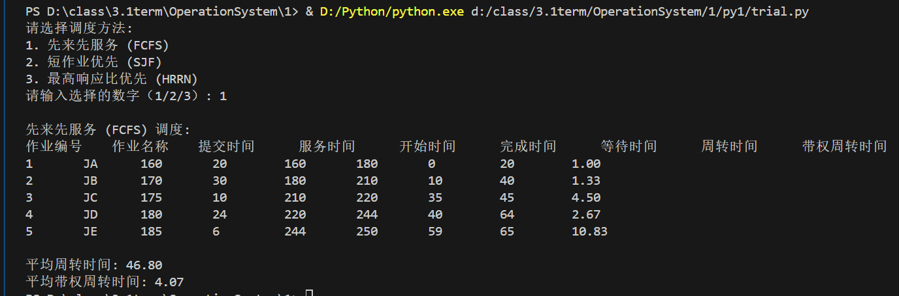
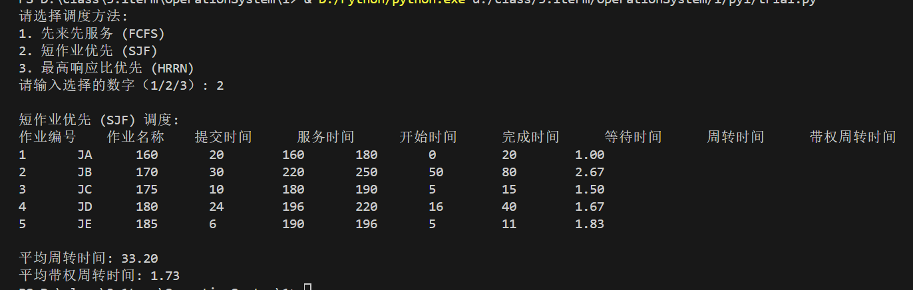
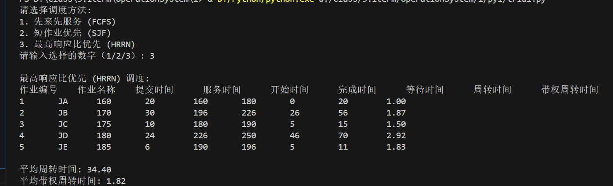

# 实验 1 作业调度实验

## 一、实验目的 （黑体，小 4 号字）

模拟作业调度算法，学习作业在操作系统中的调度过程，加深对作业管理的理解。培养学生程序设计的方法和技巧。

## 二、实验内容

本实验模拟单处理器系统的作业调度，加深对作业调度算法的理解。用某种语言编程实现先来先服务、短作业优先和最高响应比优先算法。有一些简单的界面，能够运行，仿真操作系统中作业调度的原理和过程。
1、 在后备作业队列中输入 5 道作业各自需要的时间及存储空间。数据输入格式如下：
作业编号 作业名称 提交时间 要求服务运行时间（分钟）
1 JA 02：40 20
2 JB 02：50 30
3 JC 02：55 10
4 JD 03：00 24
5 JE 03：05 6
输出为一组作业调度信息和统计信息、加权周转时间等。作业调度信息包括：
作业编号 作业名称 提交时间 要求服务运行时间 开始时间 完成时间 等待时间 周
转时间
统计信息包括： 平均周转时间、平均带权周转时间。
2、 按先来先服务（FCFS）的原则进行调度，输出作业调度的顺序及相关信息。
3、 按最短作业优先（SJF）的原则进行调度，输出作业调度的顺序及相关信息。
4、 按最高响应比优先的原则进行调度，输出作业调度顺序及相关信息。
5、 （选做）时间片轮转的原则进行调度（时间片大小可设置为 200ms），输出作业调度信息。

## 代码内容

以下是上述代码的大纲：

**一、`Job`类**
1. **用法**
   - 用于表示作业的相关信息，包括作业编号、名称、提交时间、服务时间等，并且还用于计算作业执行过程中的各项时间指标，如开始时间、完成时间、等待时间、周转时间和带权周转时间。
2. **方法**
   - `__init__`方法
     - 初始化作业的各项属性，如`job_id`（作业编号）、`job_name`（作业名称）、`submit_time`（提交时间）、`service_time`（服务运行时间）等，并将开始时间、完成时间、等待时间、周转时间和带权周转时间初始化为`None`。
   - `calculate_times`方法
     - 根据传入的当前时间计算作业的开始时间（将当前时间设置为开始时间）、完成时间（开始时间加上服务运行时间）、等待时间（开始时间减去提交时间）、周转时间（完成时间减去提交时间）和带权周转时间（周转时间除以服务运行时间）。

**二、先来先服务调度算法（`fcfs`函数）**
1. **用法**
   - 按照作业的提交时间顺序进行调度，先提交的作业先执行。
2. **方法**
   - 首先按照作业的提交时间对作业列表进行排序。
   - 初始化当前时间为0，然后遍历作业列表。
   - 如果当前时间小于作业提交时间，则将当前时间更新为作业提交时间。
   - 调用作业的`calculate_times`方法计算各项时间指标，并将当前时间更新为作业完成时间。

**三、短作业优先调度算法（`sjf`函数）**
1. **用法**
   - 在作业按照提交时间顺序的基础上，优先选择服务时间短的作业进行执行。
2. **方法**
   - 先按提交时间对作业进行排序。
   - 初始化就绪队列、当前时间和作业索引。
   - 通过循环将已提交的作业按照服务时间加入就绪队列（小顶堆）。
   - 如果就绪队列不为空，则选择服务时间最短的作业执行，计算其各项时间指标，并更新当前时间；如果就绪队列为空，则将当前时间推进1分钟。

**四、最高响应比优先调度算法（`hrrn`函数）**
1. **用法**
   - 在作业按照提交时间顺序的基础上，计算作业的响应比（(等待时间 + 服务时间)/服务时间），选择响应比最高的作业进行执行。
2. **方法**
   - 先按提交时间对作业进行排序。
   - 初始化就绪队列、当前时间和作业索引。
   - 通过循环将已提交的作业按照提交时间加入就绪队列（小顶堆）。
   - 如果就绪队列不为空，则计算每个作业的响应比，选择响应比最高的作业执行，计算其各项时间指标，移除已调度作业，并更新当前时间；如果就绪队列为空，则将当前时间推进1分钟。

**五、打印作业调度信息（`print_job_info`函数）**
1. **用法**
   - 以表格形式打印每个作业的编号、名称、提交时间、服务时间、开始时间、完成时间、等待时间、周转时间和带权周转时间。
2. **方法**
   - 先打印表头，然后遍历作业列表，按照指定格式打印每个作业的各项属性。

**六、打印统计信息（`print_statistics`函数）**
1. **用法**
   - 计算并打印所有作业的平均周转时间和平均带权周转时间。
2. **方法**
   - 计算所有作业的周转时间总和与带权周转时间总和，然后分别除以作业数量得到平均周转时间和平均带权周转时间，并打印结果。

## 代码

```python
import heapq

class Job:
    def __init__(self, job_id, job_name, submit_time, service_time):
        self.job_id = job_id  # 作业编号，用于唯一标识每个作业
        self.job_name = job_name  # 作业名称，方便识别作业内容
        self.submit_time = submit_time  # 提交时间，记录作业提交的时间（以分钟为单位）
        self.service_time = service_time  # 服务运行时间（分钟），表示作业执行所需的时间
        self.start_time = None  # 开始时间，初始化为None，后续会计算作业开始执行的时间
        self.finish_time = None  # 完成时间，初始化为None，后续会计算作业完成的时间
        self.wait_time = None  # 等待时间，初始化为None，后续会计算作业等待执行的时间
        self.turnaround_time = None  # 周转时间，初始化为None，后续会计算作业从提交到完成的总时间
        self.weighted_turnaround_time = None  # 带权周转时间，初始化为None，后续会计算周转时间与服务时间的比值

    # 计算作业的开始时间、完成时间、等待时间、周转时间和带权周转时间
    def calculate_times(self, current_time):
        self.start_time = current_time  # 将当前时间设置为作业的开始时间
        self.finish_time = current_time + self.service_time  # 完成时间等于开始时间加上服务运行时间
        self.wait_time = self.start_time - self.submit_time  # 等待时间为开始时间减去提交时间
        self.turnaround_time = self.finish_time - self.submit_time  # 周转时间为完成时间减去提交时间
        self.weighted_turnaround_time = self.turnaround_time / self.service_time  # 带权周转时间为周转时间除以服务运行时间

# 先来先服务调度算法
def fcfs(jobs):
    jobs.sort(key=lambda job: job.submit_time)  # 按提交时间排序，使得先提交的作业排在前面
    current_time = 0
    for job in jobs:
        if current_time < job.submit_time:  # 如果当前时间小于作业提交时间
            current_time = job.submit_time  # 等待作业提交，如果当前时间小于作业提交时间，就将当前时间更新为作业提交时间
        job.calculate_times(current_time)   # 计算作业的开始时间、完成时间、等待时间、周转时间和带权周转时间
        current_time = job.finish_time  # 将当前时间更新为作业完成时间

# 短作业优先调度算法
def sjf(jobs):
    jobs.sort(key=lambda job: job.submit_time)  # 按提交时间排序，先处理先提交的作业
    ready_queue = []  # 就绪队列，用于存储等待执行的作业
    current_time = 0 # 当前时间，初始化为0
    idx = 0 # 当前作业的索引，初始化为0

    while idx < len(jobs) or ready_queue:  # 将所有已经提交的作业加入到就绪队列
        while idx < len(jobs) and jobs[idx].submit_time <= current_time:
            heapq.heappush(ready_queue, (jobs[idx].service_time, jobs[idx]))  # 将作业按照服务时间（小顶堆）加入就绪队列，服务时间短的作业优先
            idx += 1
        if ready_queue:  # 如果就绪队列不为空，就选择响应时间最短的作业执行
            _, job = heapq.heappop(ready_queue) # 选择服务时间最短的作业
            job.calculate_times(current_time) # 计算作业的开始时间、完成时间、等待时间、周转时间和带权周转时间
            current_time = job.finish_time # 将当前时间更新为作业完成时间
        else:
            current_time += 1  # 如果没有作业，就等1分钟，时间推进1分钟

# 最高响应比优先调度算法
def hrrn(jobs):
    jobs.sort(key=lambda job: job.submit_time)  # 按提交时间排序，先处理先提交的作业
    ready_queue = [] # 就绪队列，用于存储等待执行的作业
    current_time = 0 # 当前时间，初始化为0
    idx = 0
    while idx < len(jobs) or ready_queue:
        # 将所有已经提交的作业加入到就绪队列
        while idx < len(jobs) and jobs[idx].submit_time <= current_time:
            heapq.heappush(ready_queue, (jobs[idx].submit_time, jobs[idx])) # 将作业按照提交时间（小顶堆）加入就绪队列
            idx += 1 

        if ready_queue:
            # 计算响应比并选择响应比最高的作业
            best_job = None # 初始化最佳作业为None
            best_ratio = -float('inf') # 初始化最佳响应比为负无穷大
            for _, job in ready_queue:
                waiting_time = current_time - job.submit_time # 计算等待时间
                response_ratio = (waiting_time + job.service_time) / job.service_time # 计算响应比
                if response_ratio > best_ratio:
                    best_ratio = response_ratio # 更新最佳响应比
                    best_job = job # 更新最佳作业
            best_job.calculate_times(current_time) # 计算作业的开始时间、完成时间、等待时间、周转时间和带权周转时间
            ready_queue = [entry for entry in ready_queue if entry[1]!= best_job]  # 移除已调度作业
            current_time = best_job.finish_time
        else:
            current_time += 1  # 如果没有作业，就等1分钟，时间推进1分钟

# 打印作业调度信息
def print_job_info(jobs):
    print(f"{'作业编号':<8}{'作业名称':<8}{'提交时间':<10}{'服务时间':<10}{'开始时间':<10}{'完成时间':<10}{'等待时间':<10}{'周转时间':<10}{'带权周转时间':<10}")
    for job in jobs:
        print(f"{job.job_id:<8}{job.job_name:<8}{job.submit_time:<10}{job.service_time:<10}{job.start_time:<10}{job.finish_time:<10}{job.wait_time:<10}{job.turnaround_time:<10}{job.weighted_turnaround_time:<10.2f}")

# 打印统计信息
def print_statistics(jobs):
    total_turnaround_time = sum(job.turnaround_time for job in jobs)
    total_weighted_turnaround_time = sum(job.weighted_turnaround_time for job in jobs)
    avg_turnaround_time = total_turnaround_time / len(jobs)
    avg_weighted_turnaround_time = total_weighted_turnaround_time / len(jobs)

    print(f"\n平均周转时间: {avg_turnaround_time:.2f}")
    print(f"平均带权周转时间: {avg_weighted_turnaround_time:.2f}")


def main():
    # 输入作业数据
    jobs_data = [
        (1, "JA", 2 * 60 + 40, 20),
        (2, "JB", 2 * 60 + 50, 30),
        (3, "JC", 2 * 60 + 55, 10),
        (4, "JD", 3 * 60 + 0, 24),
        (5, "JE", 3 * 60 + 5, 6)
    ]
    # 创建作业对象
    jobs = [Job(job_id, job_name, submit_time, service_time) for job_id, job_name, submit_time, service_time in jobs_data]
    # 选择调度方法
    print("请选择调度方法:")
    print("1. 先来先服务 (FCFS)")
    print("2. 短作业优先 (SJF)")
    print("3. 最高响应比优先 (HRRN)")
    choice = input("请输入选择的数字（1/2/3）: ").strip()
    # 根据用户选择的调度算法进行调度
    if choice == '1':
        print("\n先来先服务 (FCFS) 调度:")
        fcfs(jobs)
    elif choice == '2':
        print("\n短作业优先 (SJF) 调度:")
        sjf(jobs)
    elif choice == '3':
        print("\n最高响应比优先 (HRRN) 调度:")
        hrrn(jobs)
    else:
        print("无效的选择，请重新启动程序并选择有效的调度方法。")
        return
    # 打印作业调度信息和统计信息
    print_job_info(jobs)
    print_statistics(jobs)


if __name__ == "__main__":
    main()
```

## 代码运行结果



