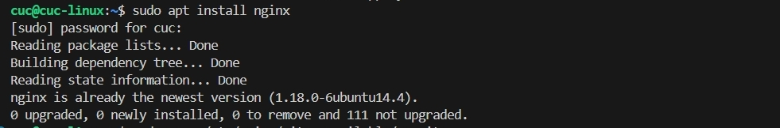
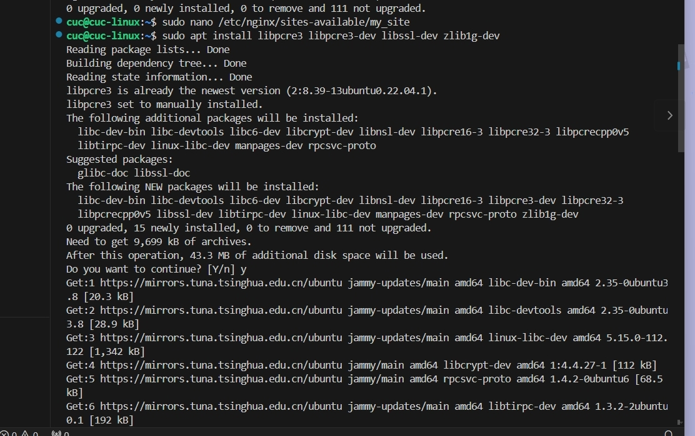
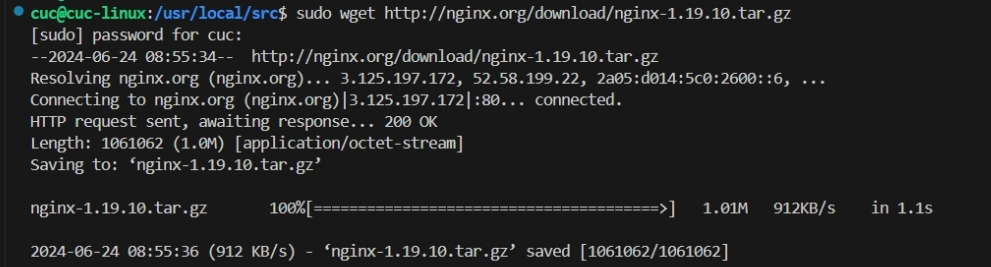
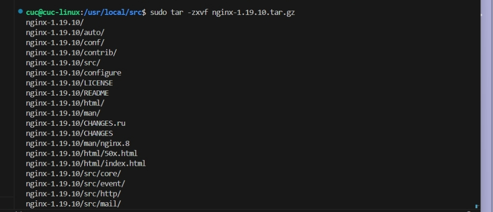
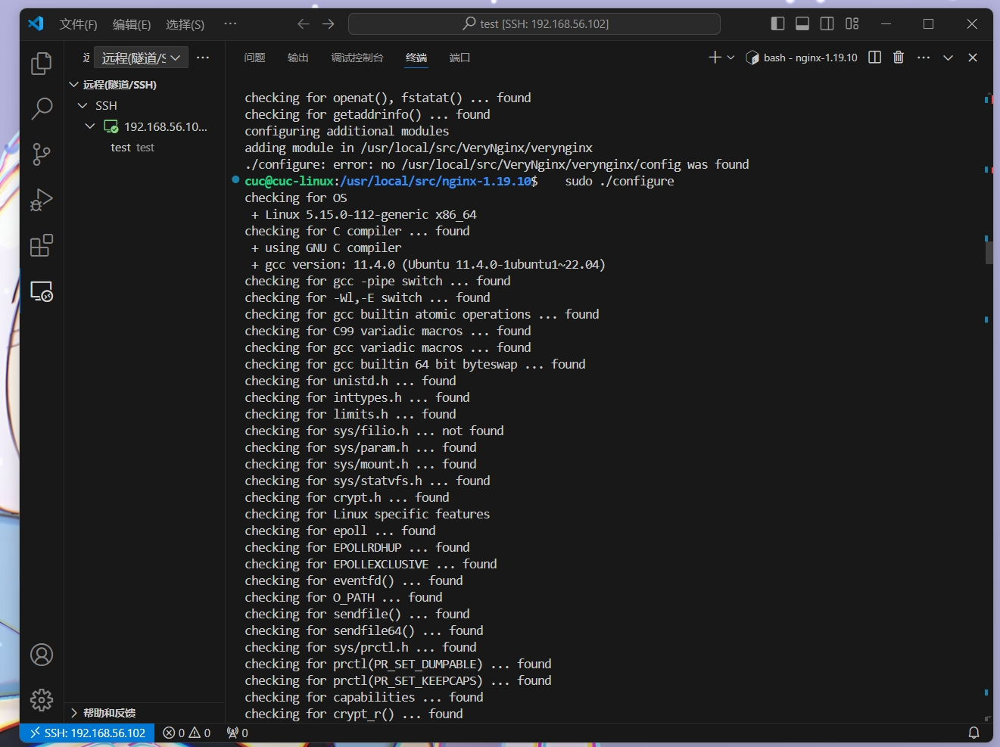
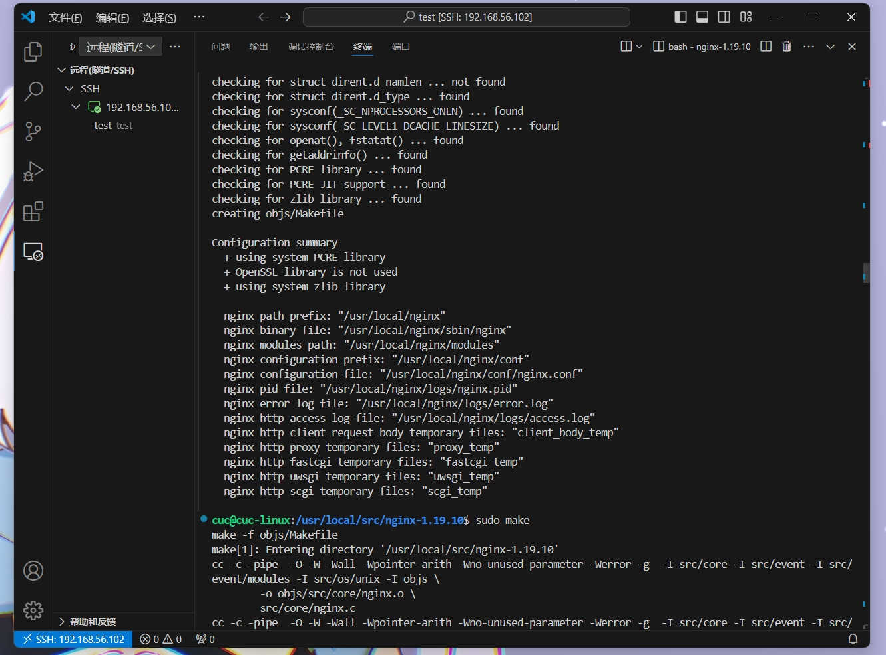
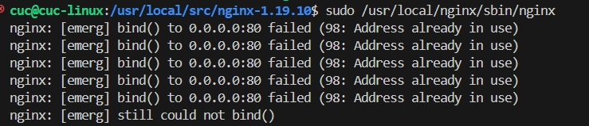
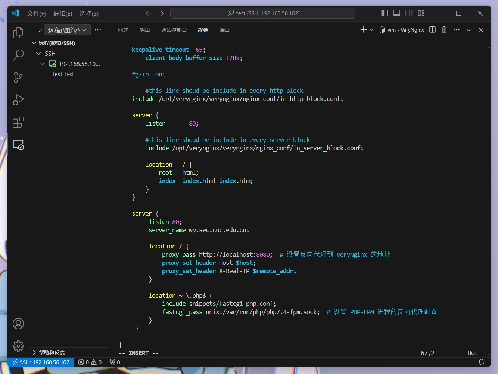
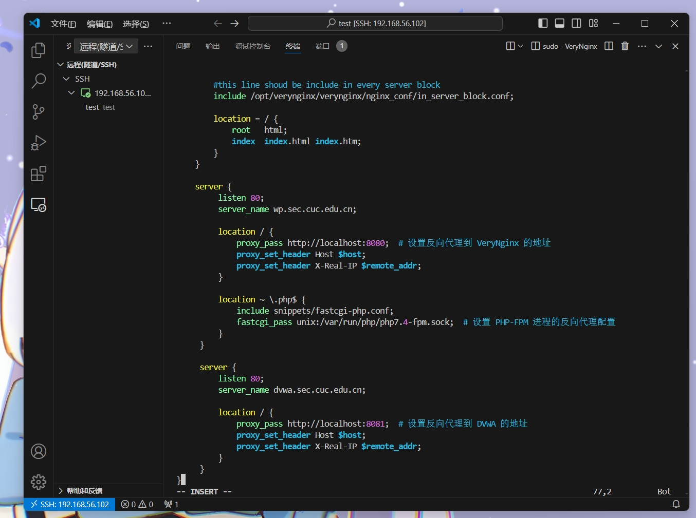

# H5 Web服务器

## 步骤1：配置Nginx和VeryNginx

1. 使用下面的指令安装nginx

`sudo apt install nginx`

2. 为VeryNginx 需要一些额外的依赖：

`sudo apt install libpcre3 libpcre3-dev libssl-dev zlib1g-dev`

3. VeryNginx需要与特定版本的Nginx一起编译。按照以下步骤编译：
`cd /usr/local/src`

`sudo wget http://nginx.org/download/nginx-1.19.10.tar.gz`  

`sudo tar -zxvf nginx-1.19.10.tar.gz`

`cd nginx-1.19.10`

4. 下载VeryNginx
`cd /usr/local/src`
`sudo git clone https://github.com/alexazhou/VeryNginx.git`

`cd VeryNginx`

5. 配置和编译Nginx与VeryNginx
   编译Nginx时，确保包含VeryNginx模块
`cd /usr/local/src/nginx-1.19.10`
`sudo ./configure `
`sudo make`

`sudo make install`

出现以下错误
`checking for OS`
 `+ Linux 5.15.0-112-generic x86_64`
`checking for C compiler ... not found`
`./configure: error: C compiler cc is not found`
发现没有安装没有安装C编译器。使用命令安装gcc
`sudo apt install build-essential`

启动进行测试

6. 配置Nginx和VeryNginx以实现使用Wordpress搭建的站点对外提供访问的地址为： http://wp.sec.cuc.edu.cn

在 Nginx 配置文件中设置反向代理和 PHP-FPM 进程的配置。添加以下配置示例到 Nginx 配置文件中：
     server {
         listen 80;
         server_name wp.sec.cuc.edu.cn;

         location / {
             proxy_pass http://localhost:8080;  # 设置反向代理到 VeryNginx 的地址
             proxy_set_header Host $host;
             proxy_set_header X-Real-IP $remote_addr;
         }

         location ~ \.php$ {
             include snippets/fastcgi-php.conf;
             fastcgi_pass unix:/var/run/php/php7.4-fpm.sock;  # 设置 PHP-FPM 进程的反向代理配置
         }
     }

7. 在现有的 Nginx 配置中添加对 Damn Vulnerable Web Application (DVWA) 的站点配置,打开您的 nginx.conf 文件或网站配置文件,创建一个新的 server 块,添加以下配置来代理到 DVWA 站点
     server {
         listen 80;
         server_name dvwa.sec.cuc.edu.cn;

         location / {
             proxy_pass http://localhost:8081;  # 设置反向代理到 DVWA 的地址
             proxy_set_header Host $host;
             proxy_set_header X-Real-IP $remote_addr;
         }
     }

8. 使用IP地址方式均无法访问上述任意站点，并向访客展示自定义的友好错误提示信息页面-1
禁止使用 IP 地址访问站点并展示自定义错误页面
在 Nginx 配置文件中添加以下配置以拒绝使用 IP 地址访问站点：
   server {
       listen 80 default_server;
       server_name _;
       return 444;
   }

9. Damn Vulnerable Web Application (DVWA)只允许白名单上的访客来源IP，其他来源的IP访问均向访客展示自定义的友好错误提示信息页面-2
DVWA 只允许白名单 IP 访问并展示自定义错误页面
配置 Nginx 来允许白名单 IP 访问 DVWA，拒绝其他 IP 访问      
    server {
       listen 80;
       server_name your_domain.com;

       allow 192.168.1.1;  # 添加允许访问的 IP 地址
       deny all;

       location / {
           root /path/to/DVWA;
           index index.php;
       }
   }

10. 在不升级Wordpress版本的情况下，通过定制VeryNginx的访问控制策略规则，热修复WordPress < 4.7.1 - Username Enumeration
创建 VeryNginx 的 Rewrite 规则：
在 VeryNginx 中创建一个 Rewrite 规则，用于拦截 WordPress 用户名枚举的请求。
将以下规则添加到 VeryNginx 的配置中：
     `location /wp-json/wp/v2/users {
         return 403;  # 拒绝访问，不返回具体错误信息
     }`

11.  通过配置VeryNginx的Filter规则实现对Damn Vulnerable Web Application (DVWA)的SQL注入实验在低安全等级条件下进行防护
创建 VeryNginx 的 Filter 规则：
在 VeryNginx 中创建一个 Filter 规则，用于检测和防护 DVWA 的 SQL 注入实验。
使用以下规则来检测 SQL 注入攻击的关键词：
     location /dvwa {
         if ($query_string ~* "select.*from|union.*select|insert.*into|delete.*from") {
             return 403;  # 拒绝访问，可自定义友好错误页面
         }
     }

12. VeryNginx的Web管理页面仅允许白名单上的访客来源IP，其他来源的IP访问均向访客展示自定义的友好错误提示信息页面-3
限制 Web 管理页面仅允许白名单上的访客来源 IP：
在 VeryNginx 配置中添加如下规则：
     location /admin {
         allow 192.168.1.1;  # 添加允许访问的 IP 地址
         deny all;
     }

13. 通过定制VeryNginx的访问控制策略规则实现：
限制DVWA站点的单IP访问速率为每秒请求数 < 50
限制Wordpress站点的单IP访问速率为每秒请求数 < 20
超过访问频率限制的请求直接返回自定义错误提示信息页面-4
禁止curl访问     

限制 DVWA 站点的单 IP 访问速率为每秒请求数 < 50：
使用 Rate Limiting 功能配置限速规则：
     limit_req_zone $binary_remote_addr zone=dvwa_rate_limit_per_ip:10m rate=50r/s;
     server {
         location /dvwa {
             limit_req zone=dvwa_rate_limit_per_ip burst=10 nodelay;
         }
     }

限制 Wordpress 站点的单 IP 访问速率为每秒请求数 < 20：
同样使用 Rate Limiting 功能配置限速规则：

     limit_req_zone $binary_remote_addr zone=wordpress_rate_limit_per_ip:10m rate=20r/s;
     server {
         location /wordpress {
             limit_req zone=wordpress_rate_limit_per_ip burst=10 nodelay;
         }
     }

超过访问频率限制的请求直接返回自定义错误提示信息页面：
添加错误页面配置和返回规则：
     limit_req_zone $binary_remote_addr zone=wordpress_rate_limit_per_ip:10m rate=20r/s;
     server {
         location /wordpress {
             limit_req zone=wordpress_rate_limit_per_ip burst=10 nodelay;
         }
     }

超过访问频率限制的请求直接返回自定义错误提示信息页面：
添加错误页面配置和返回规则：
     error_page 429 =200 /custom_error_page.html;
     location = /custom_error_page.html {
         root /path/to/error_pages;
     }

禁止 curl 访问：
可以使用 User Agent 检测来禁止 curl 访问：
     if ($http_user_agent ~* (curl|wget)) {
         return 403;
     }

