# H5 Web服务器

## 1.安装nginx

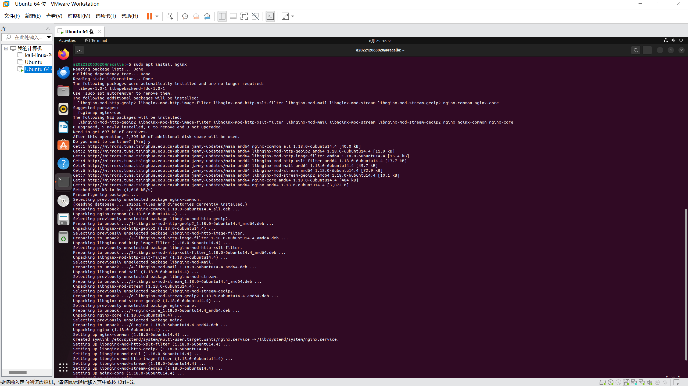

## 2.安装相应的包和环境

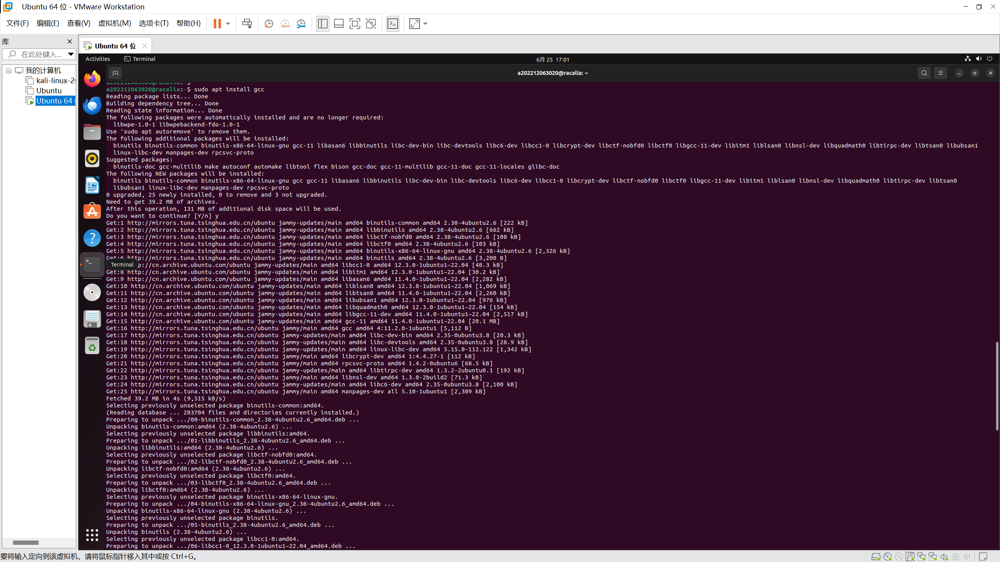
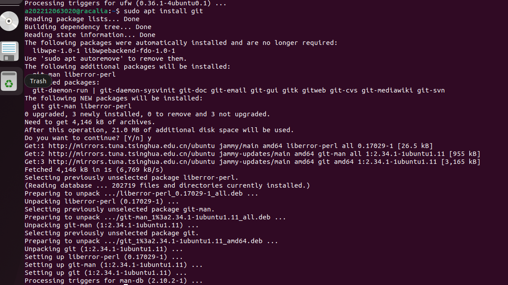
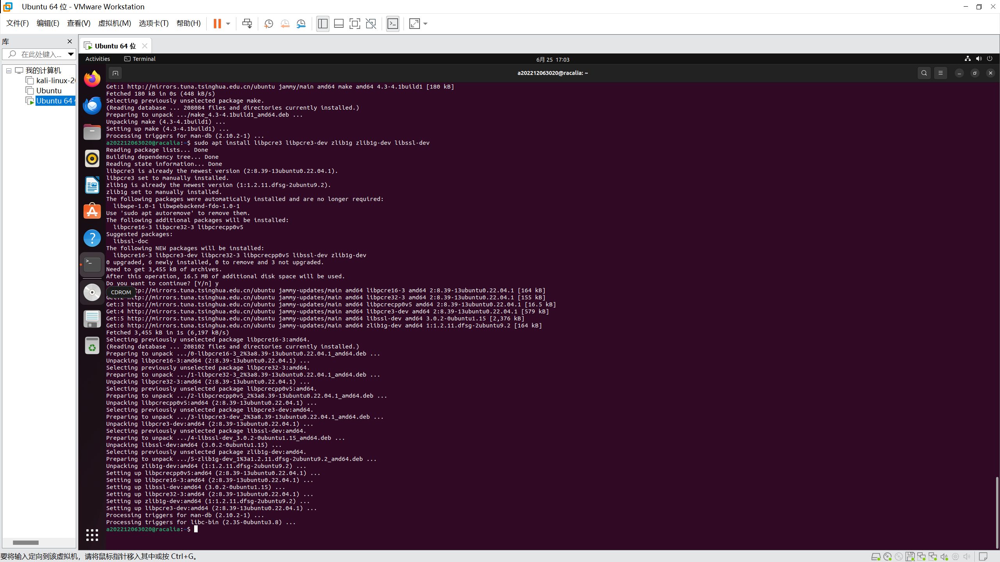
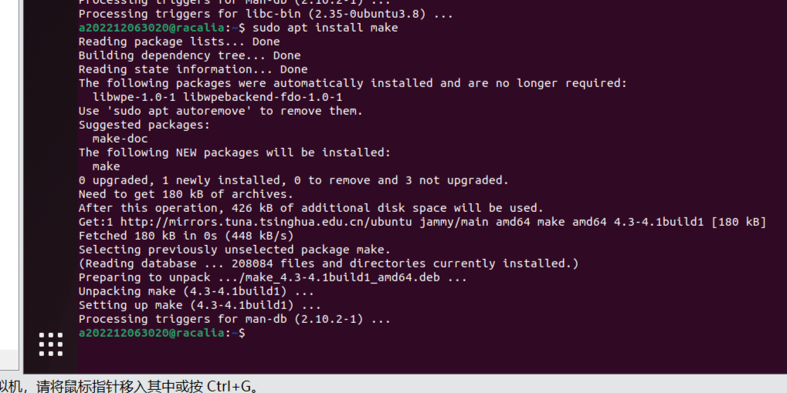

## 3.安装VeryNginx

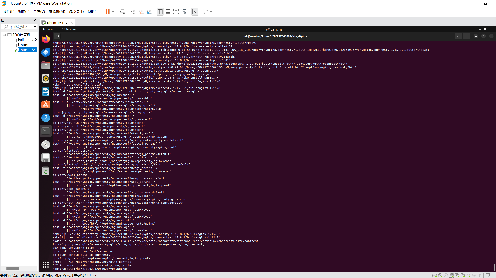

## 4.安装配置wordpress

（1）安装wp环境
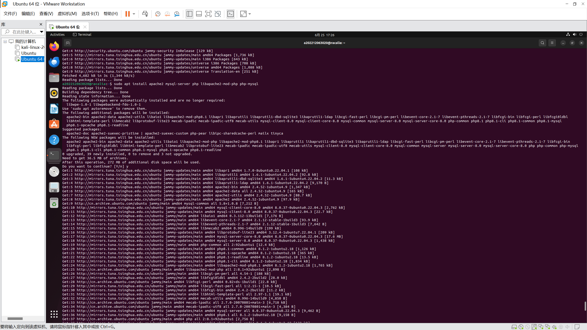
（2）下载并解压wordpress
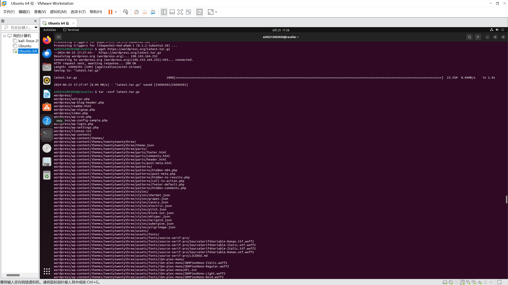
（3）配置好apache2
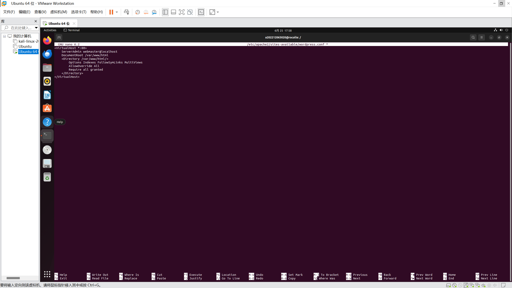
（4）因为80端口被占用，修改为8080端口
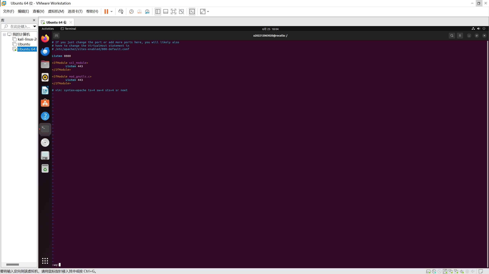
（5）打开浏览器进行wordpress安装

## 5.配置Nginx和VeryNginx以实现使用Wordpress搭建的站点对外提供访问的地址为： http://wp.sec.cuc.edu.cn

在 Nginx 配置文件中设置反向代理和 PHP-FPM 进程的配置。添加以下配置示例到 Nginx 配置文件中：
server {
    listen 80;
    server_name wp.sec.cuc.edu.cn;

    location / {
        # 配置反向代理到后端的Apache或Nginx服务器
        proxy_pass http://localhost:8080;
        proxy_set_header Host $host;
        proxy_set_header X-Real-IP $remote_addr;
        proxy_set_header X-Forwarded-For $proxy_add_x_forwarded_for;
    }

    location ~ \.php$ {
        # 配置FastCGI到PHP-FPM
        include fastcgi_params;
        fastcgi_pass unix:/run/php/php7.4-fpm.sock;  # 根据您的PHP-FPM版本更改这里的路径
        fastcgi_index index.php;
        fastcgi_param SCRIPT_FILENAME $document_root$fastcgi_script_name;
    }
}

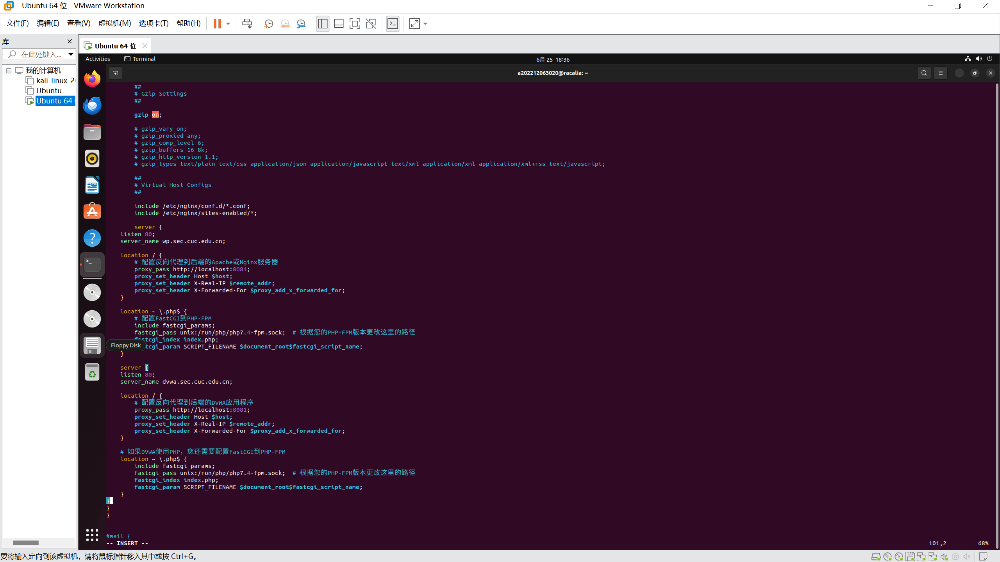

## 6.安装DVWA

（1）安装DVWA
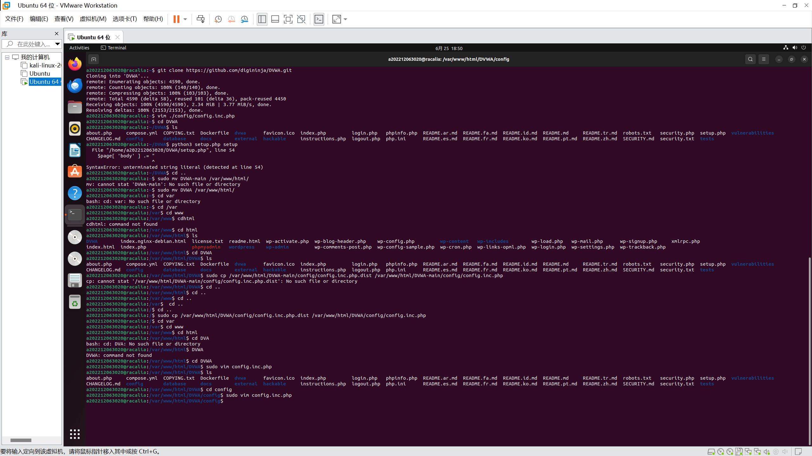
（2）配置DVWA
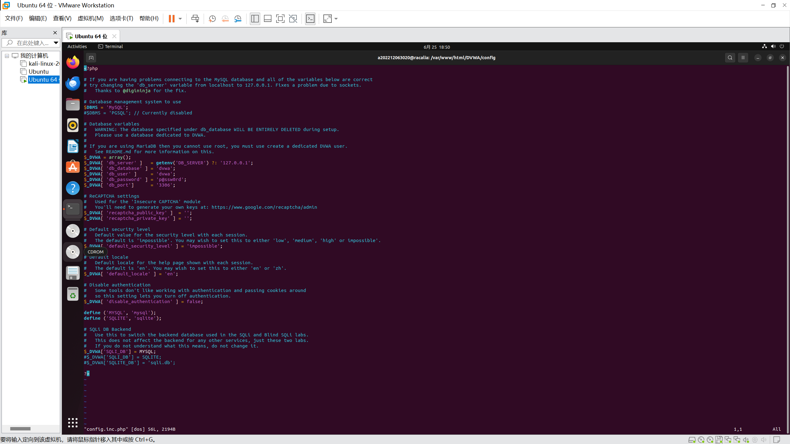

## 7.使用Damn Vulnerable Web Application (DVWA)搭建的站点对外提供访问的地址为： http://dvwa.sec.cuc.edu.cn


## 8.配置好后重新加载Nginx配置

## 9.使用IP地址方式均无法访问上述任意站点，并向访客展示自定义的友好错误提示信息页面-1

### 创建自定义错误页面并配置Apache以使用IP地址访问时显示该页面

1. **创建自定义错误页面**：
   - 在网站目录下创建一个名为`error_page.html`的文件，
   - 在`/var/www/html/`目录下创建该文件，并在其中添加以下内容：
     ```html
     <!DOCTYPE html>
     <html lang="en">
     <head>
         <meta charset="UTF-8">
         <title>Oops! Something went wrong.</title>
     </head>
     <body>
         <h1>We apologize, but there seems to be an issue with your request.</h1>
         <p>Please try again later or contact support for assistance.</p>
     </body>
     </html>
     ```
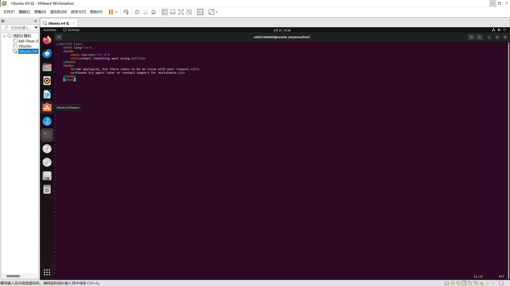

2. **配置Apache虚拟主机**：
   - 编辑Apache虚拟主机配置文件，
   - 在虚拟主机配置文件中，添加或修改`ErrorDocument`指令，以指向刚刚创建的自定义错误页面。例如：
     ```apache
     <VirtualHost *:8080>
         ...
         ErrorDocument 404 /error_page.html
         ...
     </VirtualHost>
     ```
   - 上面的配置将为HTTP 404错误指定自定义错误页面。

3. **启用并重启Apache服务**：
   - 保存并关闭配置文件后，启用虚拟主机配置（如果尚未启用）：
     ```bash
     sudo a2ensite your_site_configuration_file_name
     ```
   - 然后重启Apache服务以应用更改：
     ```bash
     sudo systemctl restart apache2
     ```
## 10.Damn Vulnerable Web Application (DVWA)只允许白名单上的访客来源IP，其他来源的IP访问均向访客展示自定义的友好错误提示信息页面-2

### 配置DVWA只允许白名单IP访问并显示自定义错误页面

1. **创建自定义错误页面**：
   - 在网站目录下创建一个名为`error_page2.html`的文件
   - 在`/var/www/html/`目录下创建该文件，并在其中添加以下内容：
     ```html
     <!DOCTYPE html>
     <html lang="en">
     <head>
         <meta charset="UTF-8">
         <title>Access Denied</title>
     </head>
     <body>
         <h1>Sorry, you are not authorized to access this site.</h1>
         <p>If you believe this is an error, please contact the administrator.</p>
     </body>
     </html>
     ```
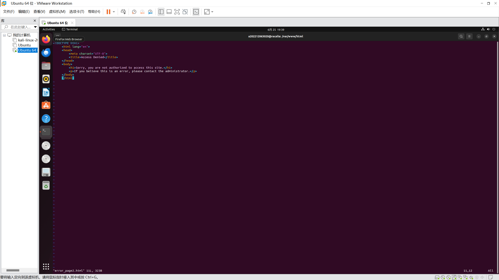

2. **配置Apache虚拟主机**：
   - 编辑Apache虚拟主机配置文件，通常位于`/etc/apache2/sites-available/`目录下。
   - 在虚拟主机配置文件中，添加`Order`, `Deny`, `Allow`和`Require`指令来限制只有白名单上的IP地址可以访问：
     ```apache
     <VirtualHost *:80>
         ...
         <Location />
             Order deny,allow
             Deny from all
             Allow from 192.168.2.129 # 白名单IP地址
         </Location>
         ...
     </VirtualHost>
     ```
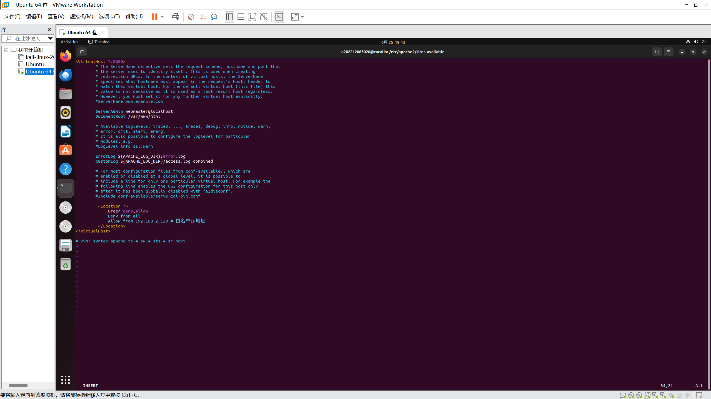

   - 同时，配置`ErrorDocument`指令，以指向您刚刚创建的自定义错误页面：
     ```apache
     ErrorDocument 403 /error_page.html
     ```

3. **启用并重启Apache服务**：
   - 保存并关闭配置文件后，启用虚拟主机配置（如果尚未启用）：
     ```bash
     sudo a2ensite config.inf.php
     ```
   - 然后重启Apache服务以应用更改：
     ```bash
     sudo systemctl restart apache2
     ```
## 11.在不升级Wordpress版本的情况下，通过定制VeryNginx的访问控制策略规则，热修复WordPress < 4.7.1 - Username Enumeration

### 热修复WordPress < 4.7.1 - Username Enumeration漏洞的方法

WordPress 4.7.0版本引入了REST API，其中包含了一个用户枚举漏洞（CVE-2017-5487），允许未经授权的用户通过REST API列出网站上的所有用户信息。

#### 定制VeryNginx访问控制策略规则

1. **禁用REST API端点**：
   在Nginx配置中添加规则，直接阻止对WordPress REST API端点的访问。
   在Nginx配置文件中添加以下规则，以阻止对`/wp-json/wp/v2/users/`端点的访问：

   ```nginx
   location ~ ^/(wp-json/wp/v2/users)/ {
       deny all;
   }
   ```

2. **重定向或返回自定义错误页面**：
   在尝试访问受保护的端点时向用户显示自定义错误页面，而不是直接拒绝访问，使其返回一个自定义的错误页面：

   ```nginx
   location ~ ^/(wp-json/wp/v2/users)/ {
       return 403 "Forbidden";
   }
   ```

3. **更新Nginx配置**：
   修改完Nginx配置后，您需要重新加载或重启Nginx服务以应用新的配置：

   ```bash
   sudo nginx -s reload
   ```
## 12.通过配置VeryNginx的Filter规则实现对Damn Vulnerable Web Application (DVWA)的SQL注入实验在低安全等级条件下进行防护

### 配置VeryNginx Filter规则进行SQL注入防护

## 12.要通过配置VeryNginx的Filter规则实现对DVWA的SQL注入实验在低安全等级条件下进行防护，您可以按照以下步骤操作：

1. **安装VeryNginx**：
   - 确保您已经安装了OpenResty，因为VeryNginx是基于OpenResty的。如果您还没有安装OpenResty，可以通过VeryNginx提供的脚本进行安装。

2. **配置VeryNginx的Filter规则**：
   - 编辑VeryNginx的配置文件，通常位于`/opt/verynginx/openresty/nginx/conf/nginx.conf`。在该文件中，您可以定义自定义的Filter规则来检测和阻止SQL注入攻击。

3. **创建SQL注入检测规则**：
   - 在配置文件中，使用`location`块来定义对特定路径的访问控制，并使用`rewrite`指令来重写不符合安全标准的请求。添加以下规则来检测SQL注入：

   ```nginx
   location ~* /your-path-to-dvwa {
       set $sql_injected false;
       if ($request_uri ~* "(SELECT|INSERT|UPDATE|DELETE|DROP|ALTER|CREATE|TRUNCATE|LOAD DATA INFILE|LOCK TABLES|UNION ALL|GROUP BY|HAVING|ORDER BY|LIMIT|CASE|WHEN|THEN|ELSE|END|JOIN|LEFT JOIN|RIGHT JOIN|OUTER JOIN|CROSS JOIN|INNER JOIN|IS NULL|IFNULL|COALESCE|CONCAT|SUBSTRING|CHARINDEX|LEN|ASCII|CAST|CONVERT|PERCENT_RANK|ROW_NUMBER|RANK|DENSE_RANK|FIRST_VALUE|LAST_VALUE|LEAD|LAG|NTILE|PERCENTILE_CONT|PERCENTILE_DISC|CUME_DIST|SUM|AVG|MIN|MAX|COUNT|STDEV|VARIANCE|STDDEV_SAMP|VAR_SAMP|BIT_AND|BIT_OR|BIT_XOR|BIT_NOT|BIT_COUNT|POWER|LOG|EXP|MOD|SIGN|FLOOR|CEILING|ROUND|TRUNCATE|ABS|ACOS|ASIN|ATAN|COS|COT|DEGREES|RADIANS|PI|SQRT|POW|E|LOG10|LOG2|LOG|EXPONENTIAL|LN||))
   }

## 13.VeryNginx的Web管理页面仅允许白名单上的访客来源IP，其他来源的IP访问均向访客展示自定义的友好错误提示信息页面-3

### 配置VeryNginx的Web管理页面访问控制

1. **编辑Nginx配置文件**：
   找到Nginx的配置文件，位于`/etc/nginx/nginx.conf`

2. **配置Web管理页面的访问控制**：
   在Nginx配置文件中，找到负责处理Web管理页面请求的`location`块，并添加`allow`和`deny`指令来限制访问。添加以下配置：

   ```nginx
   location /admin {
       allow 192.168.6.129; # 允许的IP地址
       deny all; # 禁止所有其他IP地址
       # 其他配置...
   }
   ```

3. **配置自定义错误页面**：
   为了让非白名单IP地址的访问者看到自定义的错误提示信息页面，使用`error_page`指令来指定一个自定义的错误页面：

   ```nginx
   error_page 403 /custom_error_page.html;
   ```

4. **保存并测试配置**：
   完成配置后，保存Nginx配置文件，并使用`nginx -t`命令测试配置文件的语法是否正确。如果没有错误，使用`systemctl restart nginx`或`service nginx restart`命令重启Nginx服务。

5. **验证配置效果**：
   使用不同的IP地址尝试访问Web管理页面，确保只有白名单上的IP地址能够成功访问，而其他IP地址则被重定向到自定义的错误页面。

## 通过定制VeryNginx的访问控制策略规则实现：
限制DVWA站点的单IP访问速率为每秒请求数 < 50
限制Wordpress站点的单IP访问速率为每秒请求数 < 20
超过访问频率限制的请求直接返回自定义错误提示信息页面-4
禁止curl访问

### 通过定制VeryNginx的访问控制策略规则实现访问速率限制

1. **编辑VeryNginx的配置文件**：
   VeryNginx的配置文件位于`/opt/verynginx/openresty/nginx/conf/nginx.conf`。在该文件中，定义自定义的访问控制和速率限制规则。

2. **配置速率限制**：
   使用Nginx的`limit_req_zone`和`limit_req`指令来限制单个IP地址的请求速率。对于DVWA站点，设置每秒不超过50个请求：

   ```nginx
   http {
       limit_req_zone $binary_remote_addr zone=dvwa_limit:10m rate=50r/s;

       server {
           location /your-dvwa-path {
               limit_req zone=dvwa_limit burst=100 nodelay;
               # 其他配置...
           }
       }

       server {
           location /your-wordpress-path {
               limit_req_zone $binary_remote_addr zone=wp_limit:10m rate=20r/s;
               limit_req zone=wp_limit burst=50 nodelay;
               
           }
       }
   }
   ```

   对于Wordpress站点，设置每秒不超过20个请求：

   ```nginx
   http {
       # ...

       server {
           # ...

           location /your-wordpress-path {
               limit_req_zone $binary_remote_addr zone=wp_limit:10m rate=20r/s;
               limit_req zone=wp_limit burst=50 nodelay;
               
           }
       }
   }
   ```

3. **禁止`curl`访问**：
   通过检查请求头来识别`curl`命令发起的请求，并阻止这些请求。例如：

   ```nginx
   if ($http_user_agent ~ "^curl") {
       return 403;
   }
   ```

   将上述配置添加到相应的`location`块中。