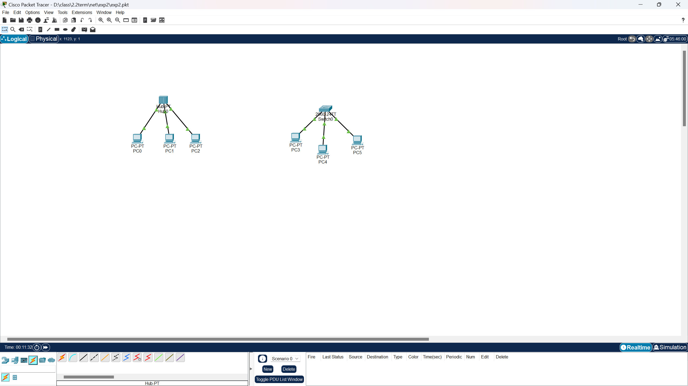
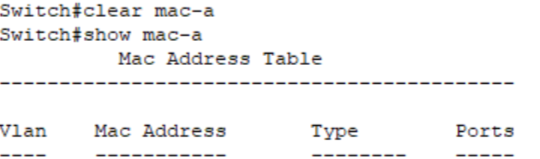
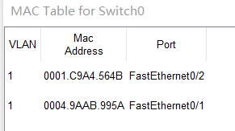

# Hub vs Switch

## Step 1

按要求放好图标，如图

## Step 2

配置好各个PC的ip地址和子网掩码

## Step 3

连接各个机器，线上标志是绿的，成功

## Step 4

在simulation模式中由PC0pingPC1
### Reflect:
PC0发给PC1的ping包不仅发送给了PC1，还发送给了PC2。因为集线器的工作原理是广播形式，无论哪个端口收到数据之后，都要广播到所有的端口。

## Step 5

首先先清除交换机保存的mac地址

用 PC3 ping PC4后的 mac 表

可见交换机不再把接收到的帧进行广播，而是发送给了目的地址。
### Reflect
PC3发给PC4的ping包只发送给了PC4，其他站没有收到。因为交换机根据mac地址转发数据，收到数据包之后，检查报文的目的mac地址，找到对应的端口进行转发，而不是广播到所有的端口。

可见交换机的学习机制：
1.将接收到的报文中mac地址存入mac地址表。
2.广播询问目的地址的mac地址，等目的地址单播回应时，把其mac地址存入mac 地址表。

mac表中增加了PC5的mac地址。

## Reflect

### 通过实验，你发现Hub和Switch有什么区别了吗？请简述。

　集线器采用广播的形式传输数据，即向所有端口传送数据。
交换机上的所有端口均有独享的信道带宽，以保证每个端口上数据的快速有效传输。交换机为用户提供的是独占的、点对点的连接，数据包只被发送到目的端口，而不会向所有端口发送。
　　集线器是一种共享设备，本身不能识别目的地址，当同一网内的a主机向b主机发送数据时，数据包在以hub为架构的网络上以广播方式传输，由每一台终端通过验证数据包头的地址信息来确定是否接收，同一时刻网络上只能传输一组数据帧的通讯。此方式共享带宽。
　　交换机基于mac地址识别，能完成封装转发数据功能的设备。
　　交换机可以学习mac地址，放在内部地址表中，通过在数据帧的始发者和接收者之间建立临时的交换路径，使数据从源地址到达目的地址。

### 说明交换机如何转发广播包的？

交换机在接收到数据包时，会根据数据包中的目标MAC地址来确定数据包应该转发到哪个端口。这是因为交换机会维护一个MAC地址表，记录着每个MAC地址对应的端口信息。当交换机收到数据包时，会查找MAC地址表，找到目标MAC地址对应的端口，并将数据包转发到该端口上。 

对于广播包，交换机的处理方式有所不同。当一台计算机发送广播数据包时，交换机会将该数据包转发到所有的端口上，从而实现广播功能。这是因为广播包的目的MAC地址通常是一个特殊的广播地址（例如全1的MAC地址），指示交换机将数据包发送到所有端口，除了发送端口本身。 