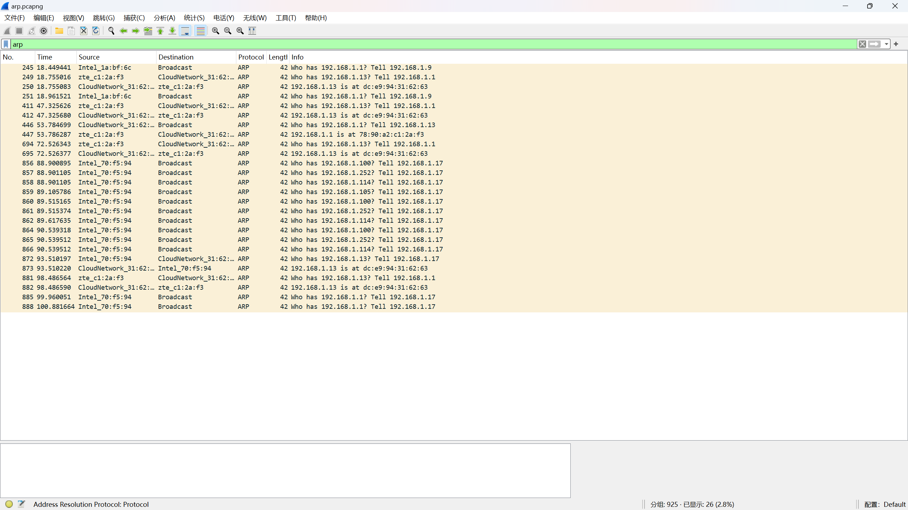
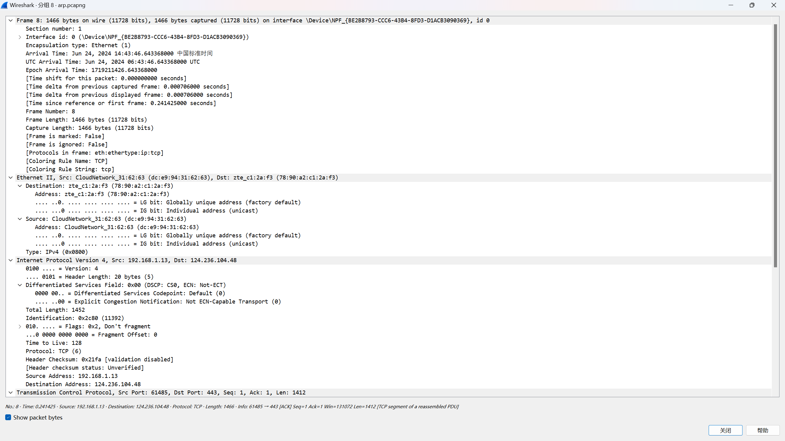

# ARP与IP包分析

## 找到一个ARP请求分组，和对它的响应分组，观察ARP包的封装层次，是否所有的ARP请求都是广播包？（尝试使用显示过滤规则）

不是所有ARP请求都是广播包

## 找到一个IPv4报文，观察IP层首部，分析IP首部各字段值，并说明其含义，例如该IP协议版本号是多少？首部长度是几个字节？整个IP数据报长度是多少字节？源IP地址和目的IP地址各是什么？等等,尽量全面。

ip协议版本号是4
首部长度是20字节
整个长度是1452字节
源IP是192.168.1.13
目的ip是124.236.104.48

## 根据抓到的IP Header内容，计算校验和，并验证。

首部校验和=ffff-(4500+05ac+2c80+4000+8006+21fa+c0a8+010d+7cec+6830)=0x21fa
相同