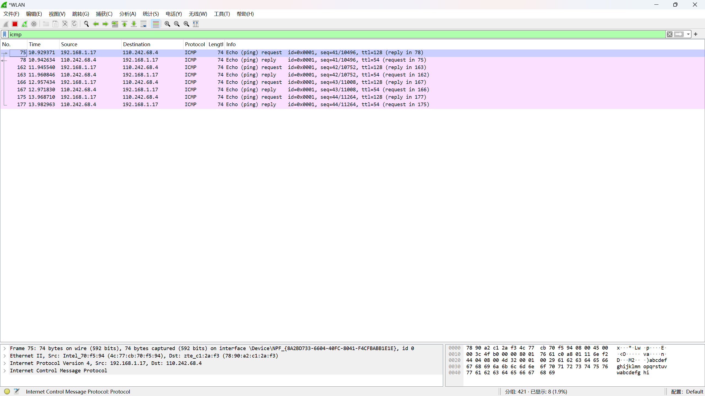
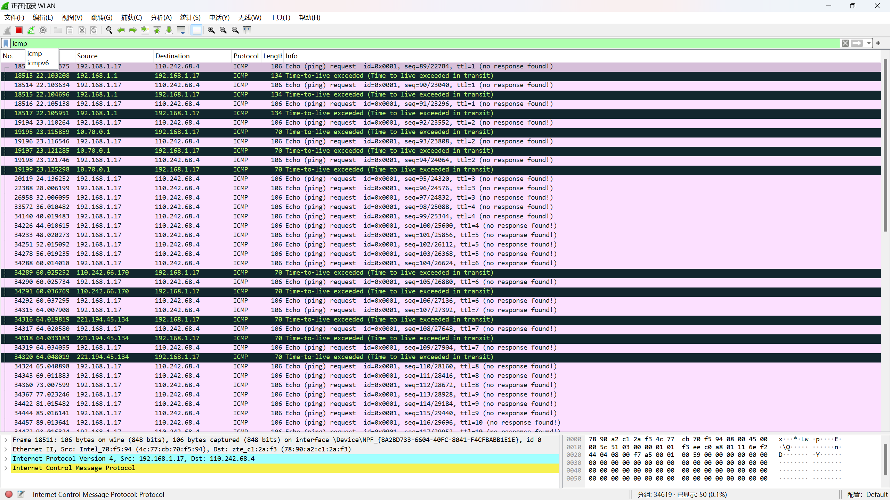

# Ping与Tracert
 
# 实验操作系统版本 win11 23H2

## ping互联网上的某个主机，并抓包找到ICMP的请求包和相应的回应包，分析ping命令的原理

工作原理：
当在命令行界面输入ping命令后跟一个IP地址或域名时，Ping会向指定的地址发送一个小型的数据包，并等待一个响应。如果数据包成功返回，Ping会显示一个消息，告诉数据包已经到达目的地，并且通常还会显示往返时间（RTT），这是数据包从发送端到接收端再返回发送端所需的时间。
Ping命令的工作流程
发送ICMP回显请求：Ping命令会创建一个ICMP回显请求消息，并将其发送到指定的IP地址。
等待ICMP回显应答：接收方收到ICMP回显请求后，如果网络畅通，会立即发送一个ICMP回显应答消息作为响应。
计算往返时间：发送方收到ICMP回显应答消息后，会计算从发送请求到接收应答的时间间隔，即往返时间（RTT）。
重复发送：Ping命令通常会多次发送ICMP回显请求，以检查网络的稳定性和性能。

## 使用命令tracert –d www.baidu.com，抓取过程中的所有ICMP包，对应控制台上的显示信息，描述tracert命令的实现过程。

工作原理：
通过发送一系列带有递增生存时间（Time To Live, TTL）值的互联网控制消息协议（ICMP）回显请求（对于IPv4）或用户数据报协议（UDP）数据包（对于IPv6），来确定数据包的传输路径。
工作原理
发送初始数据包：Tracert命令首先发送一个TTL值为1的ICMP回显请求或UDP数据包到目标地址。
TTL递减：当数据包到达第一个路由器时，路由器会将TTL值减1。如果TTL值减至0，路由器会丢弃该数据包，并向源地址发送一个ICMP超时消息。
记录路径：源地址收到ICMP超时消息后，知道数据包经过了第一个路由器，并记录下该路由器的IP地址。
增加TTL值：Tracert命令再次发送一个TTL值为2的数据包，以此类推，直到数据包到达目标地址或TTL值达到预定的最大值（通常为30）。
显示结果：Tracert命令会显示每一跳的IP地址、响应时间以及可能的主机名（如果能够解析）。

## 说明ping和tracert命令执行时，命令行中显示的时间是怎么得出的

### Ping命令中显示的时间

当执行Ping命令时，命令行中显示的时间是指从发送ICMP回显请求到接收到ICMP回显应答所经过的时间。这个时间通常被称为往返时间（Round-Trip Time, RTT）。Ping命令会发送一个ICMP回显请求到指定的地址，并等待目标主机返回一个ICMP回显应答。一旦收到应答，Ping就会计算从发送请求到接收应答所经过的时间，并将这个时间显示在命令行中。如果在预设的超时时间内没有收到应答，Ping会认为该请求失败，并显示超时信息。 

### Tracert命令中显示的时间

Tracert命令通过发送一系列ICMP回显请求来追踪数据包从源头到目的地所经过的路由。每次发送请求后，Tracert都会开始计时，直到接收到应答或者超时。超时时间一般为1秒，如果在超时时间内没有接收到应答，则认为该请求失败。Tracert命令显示的时间是指从发送请求到接收到应答所经过的时间，这个时间同样是往返时间（RTT）。通过这种方式，Tracert命令可以帮助您识别数据包在网络中的传输路径，以及在每个节点上的延迟情况。 