# IP网络划分与路由配置

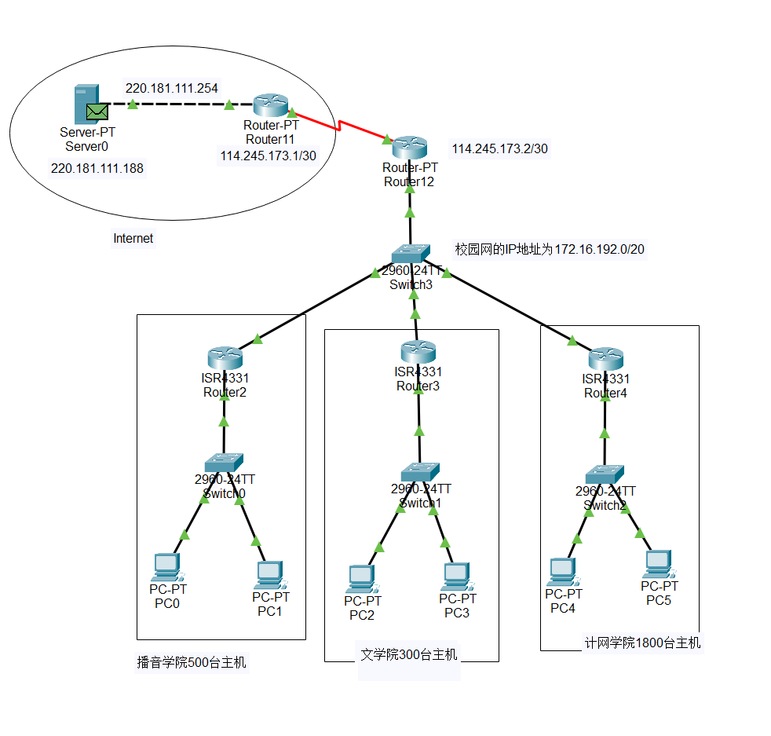

## 记录地址块的分配方案，列出每个局域网的网络号、子网掩码、最小主机IP、最大主机IP。

### 波音

网络号：172.16.203.254
子网掩码：255.255.254.0
最小主机IP：172.16.202.1
最大主机IP：172.16.203.254

### 文学

网络号：172.16.201.254
子网掩码：255.255.254.0
最小主机IP：172.16.200.1
最大主机IP：172.16.201.254

### 计网

网络号：172.16.199.254
子网掩码：255.255.248.0
最小主机IP：172.16.192.1
最大主机IP：172.16.199.254

## 记录各路由器的路由表。

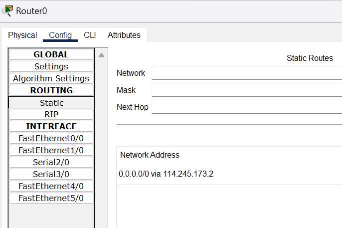
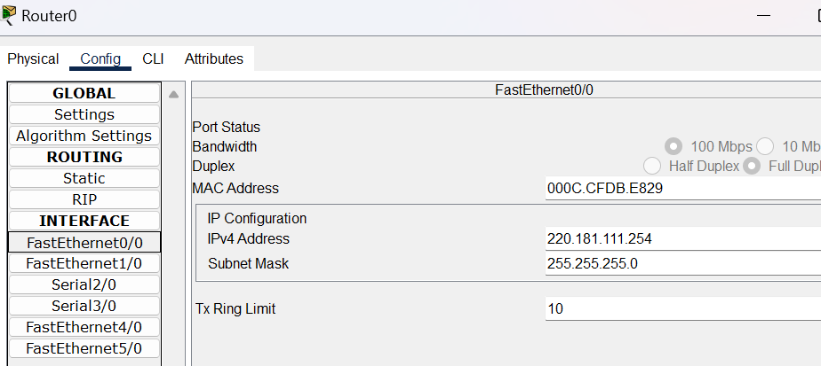
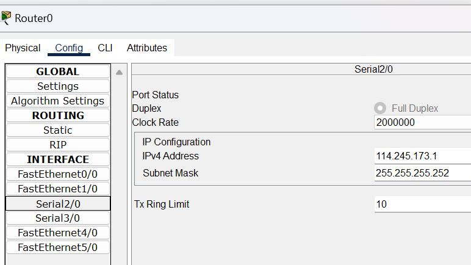
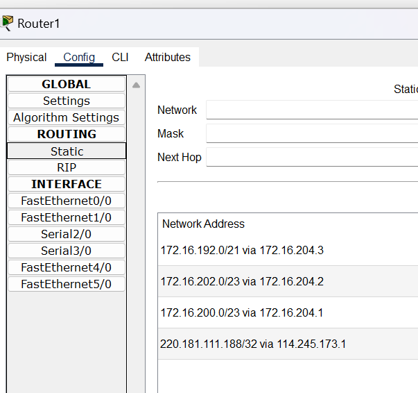
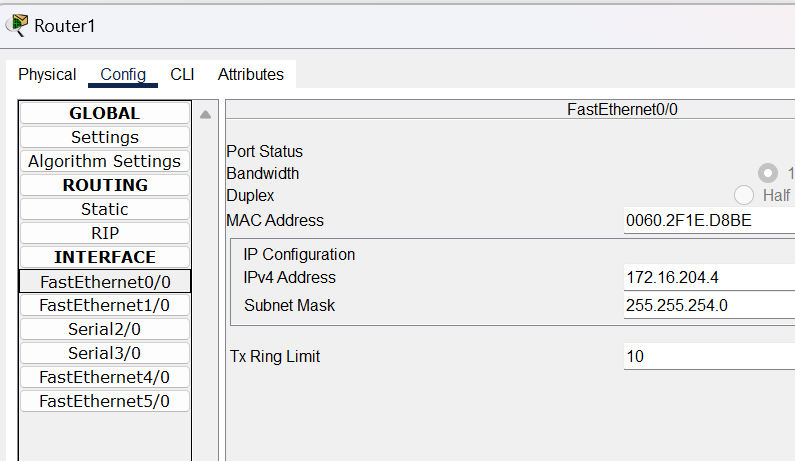
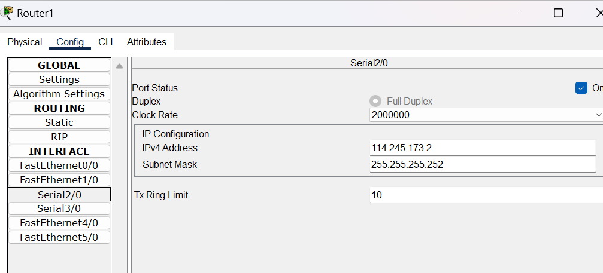
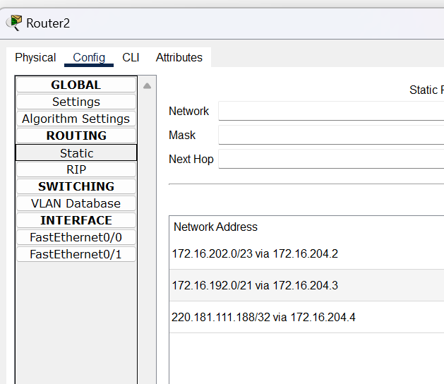
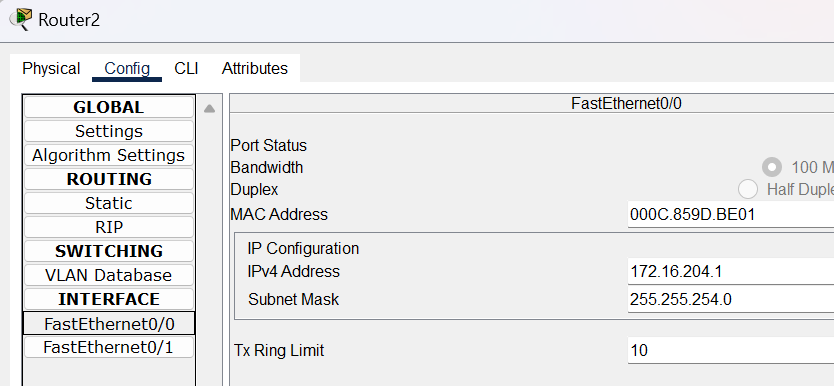
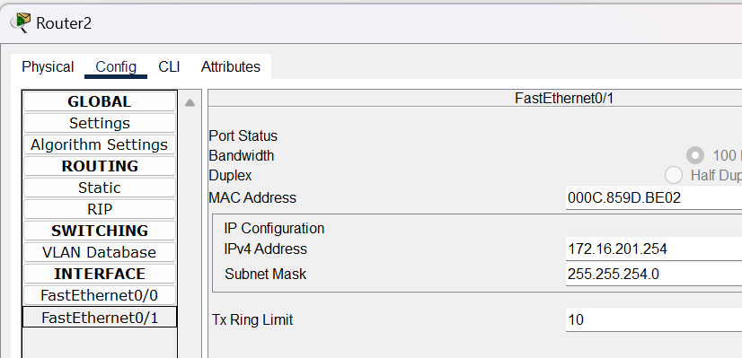
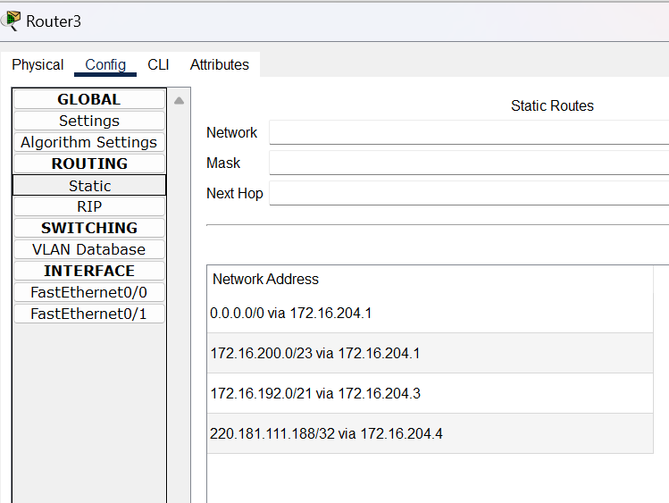
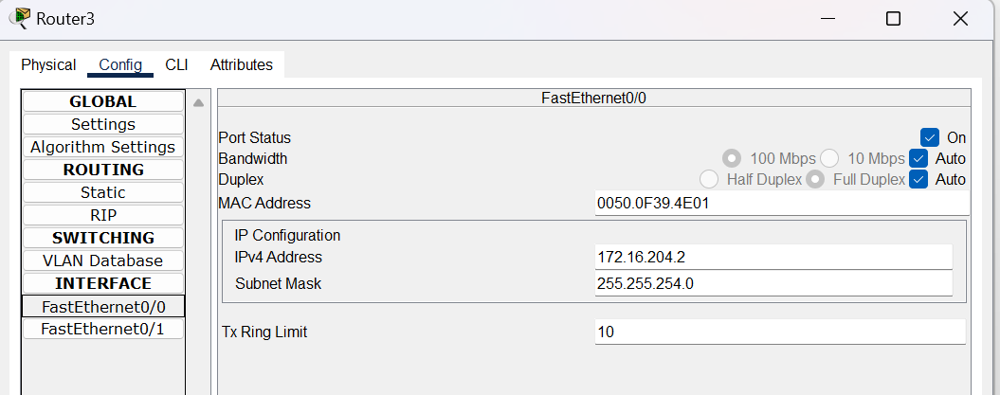
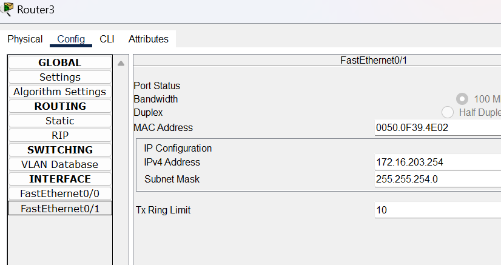
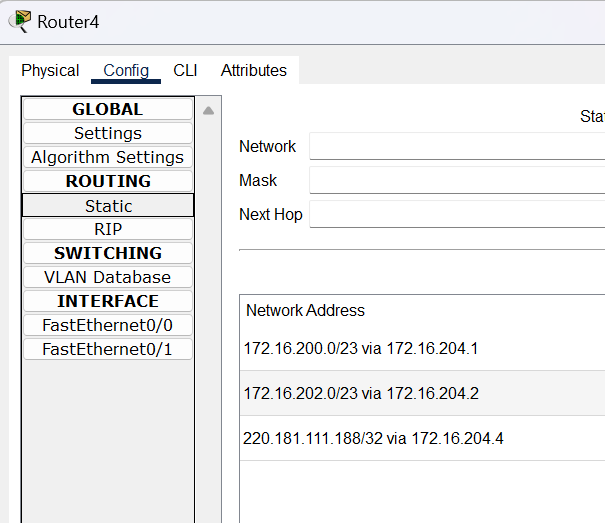
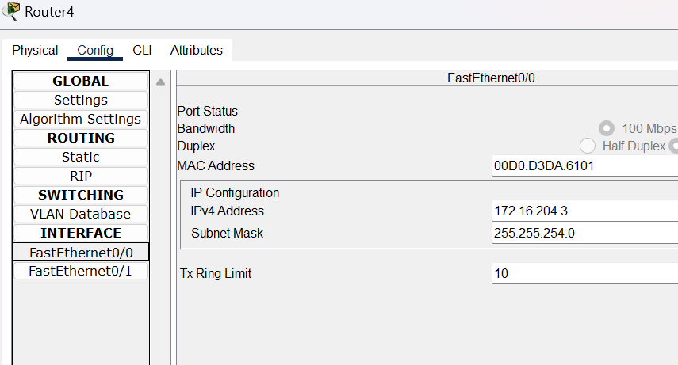
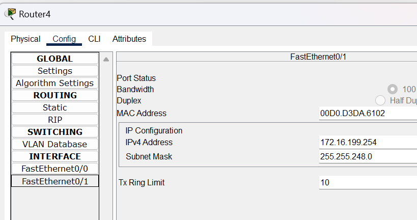

## 记录各主机的网络配置情况

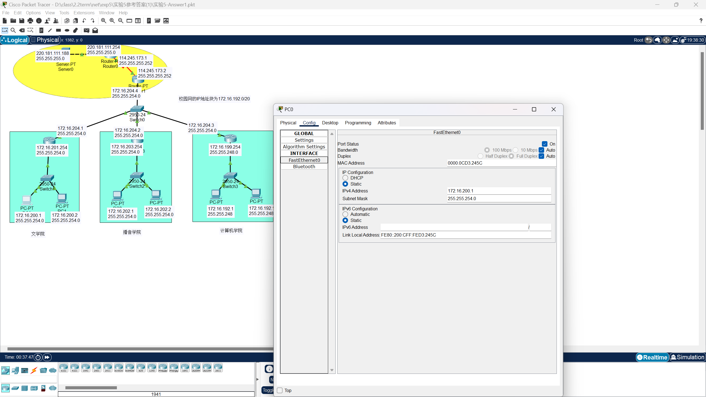

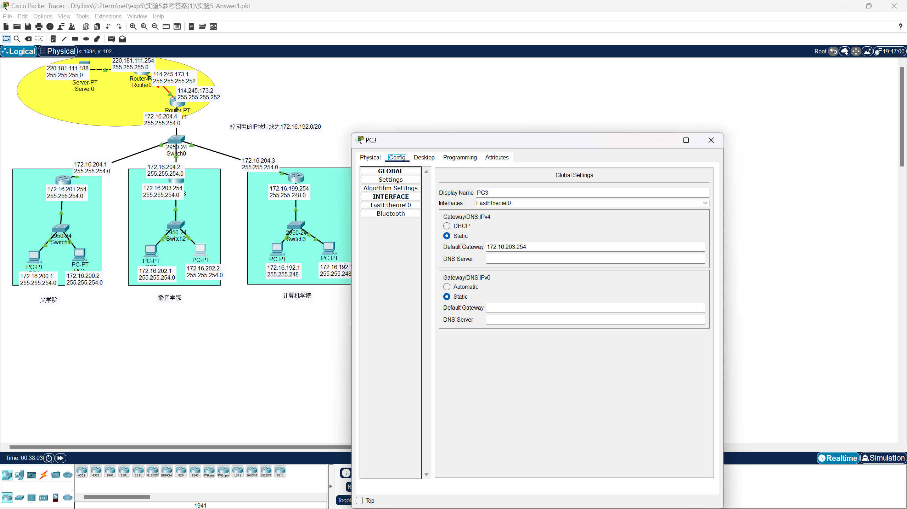

