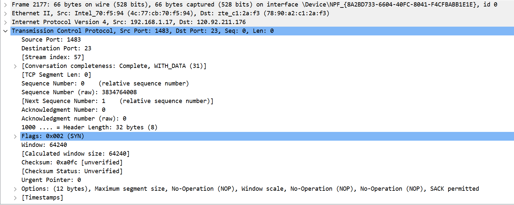
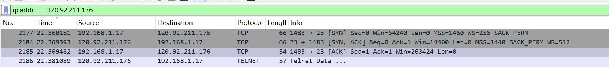
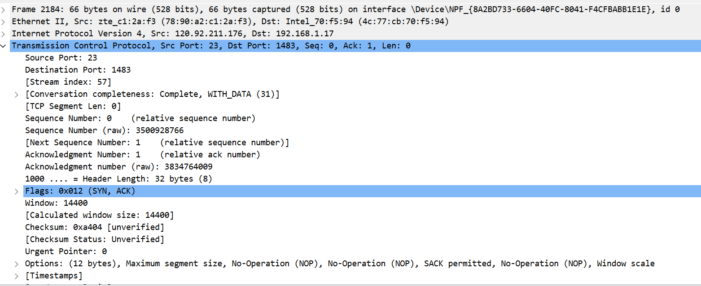
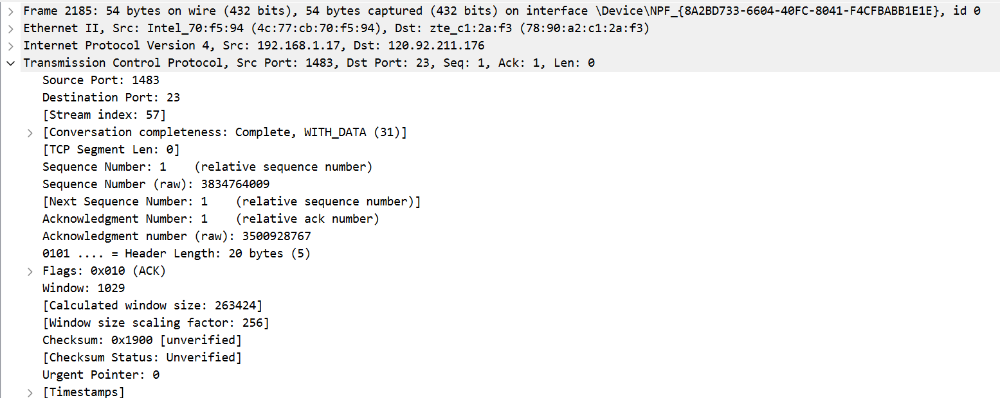
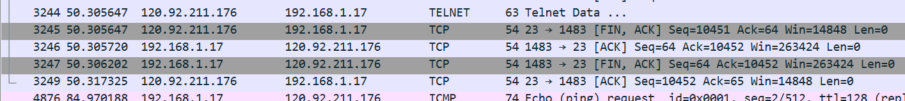
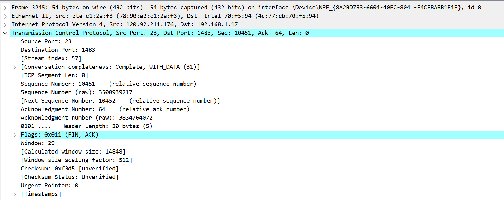
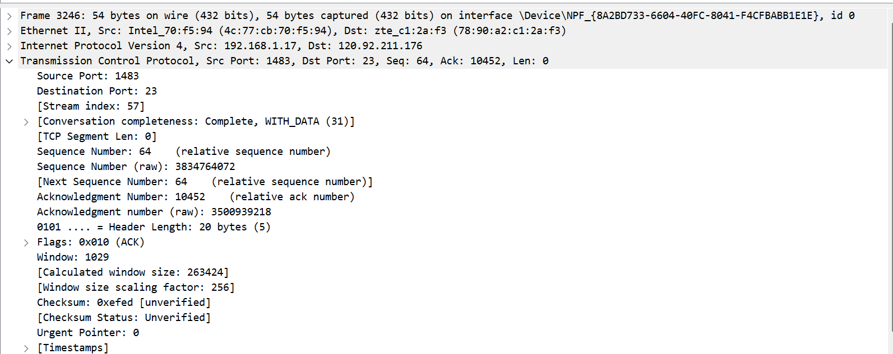
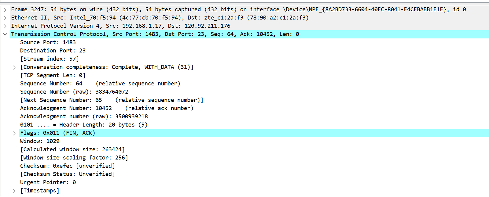

# TCP协议分析

## 分析各报文段的作用

source port:源端口
Destination port:目的端口
Sequence number:序号
Acknowledgement number:确认序号
Header Length:头部长度
Flags:标志位
Widow size value:窗口大小
Checksum:校验和
Urgent pointer:紧急指针

## 时序关系

### 建立连接

1.主机发起一个TCP请求

2.服务器响应连接请求

3.主机返回ACK完成三次握手成功建立连接

### 释放连接

1.TCP服务器发送一个FIN关闭服务器到客户端的数据传送 FIN=1

2.客户端接收这个FIN发回一个ACK确认序号为收到的序号+1 ACK=1

3.服务器关闭客户端的连接，发送一个FIN给客户端 FIN=1,ACK=1

4.客户端发回ACK报文确认，并将确认序号设置为收到序号+1 ACK=1

## 使用telnet时，客户端和服务器端使用的IP地址和端口号分别是什么？
客户端：192.168.1.17:1483
服务器：120.92.211.176:23