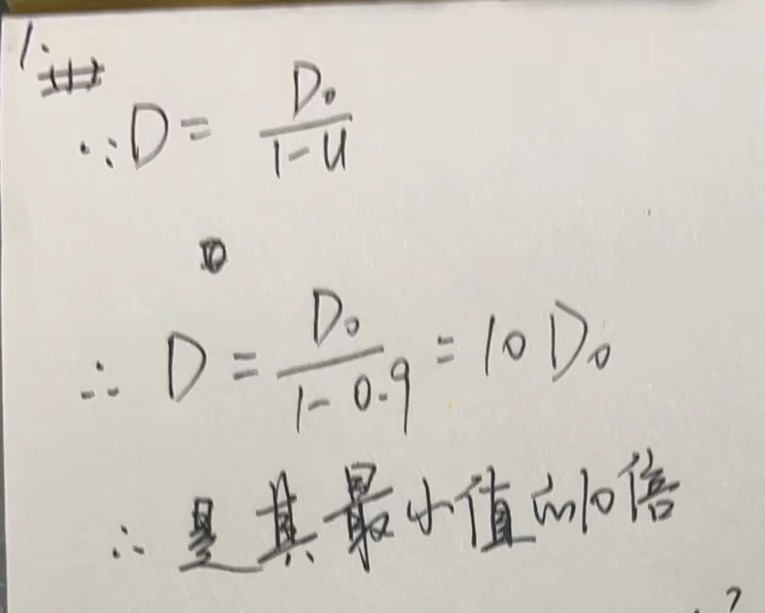
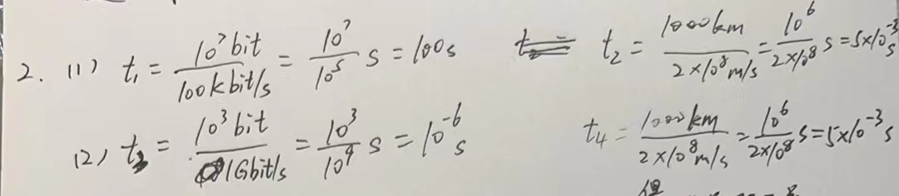
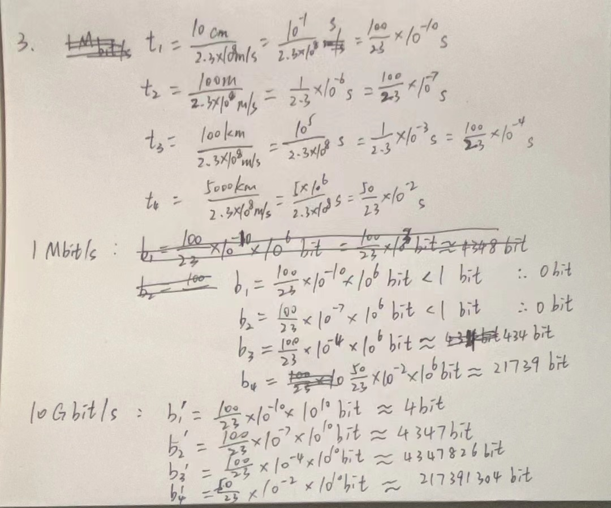
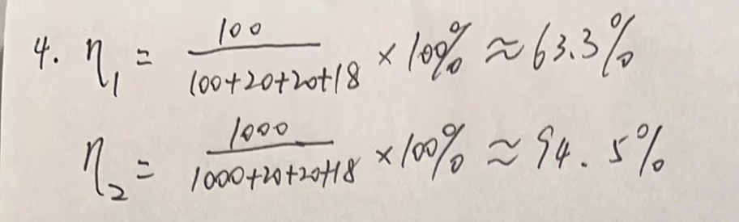
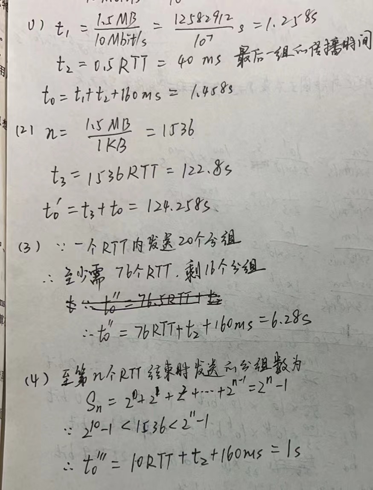
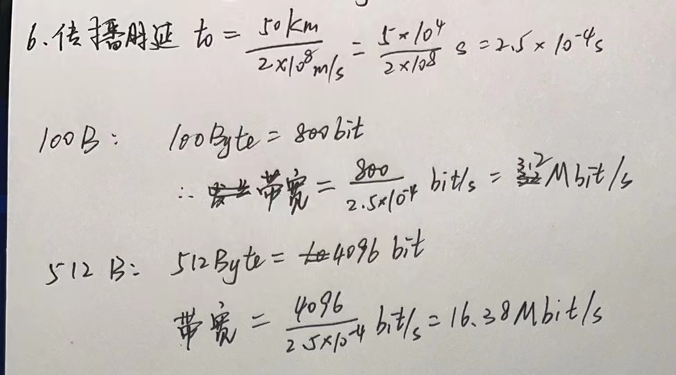

#一. 简答题

##1.网络的三要素是什么？各有什么含义？

(1)计算机及辅助设备：包括服务器、工作站、路由器、交换机等。
(2)通信介质：通信介质包括有线的如双绞线、光纤，以及无线的如无线电波、微波等。
(3)网络软件：包括操作系统中的网络组件、通信协议程序、网络管理软件等。

##2.简述OSI参考模型与TCP/IP模型的异同，简述五层协议网络体系结构各层的主要功能。

(1)共同点在于都采用了层次结构，并且都能提供连接和无连接两种通信服务机制。不同点在于，OSI模型采用了七层结构，TCP/IP模型是四层结构。
(2)①应用层：直接为用户的应用进程提供服务
②传输层：负责向两个主机中进程之间的通信提供服务。通过端口(port)提供复用和分用功能。
③网络层：负责为分组交换网上的不同主机提供通信服务。将上层运输层产生的报文段或用户数据报封装成Packet(分组或包)进行传送。选择合适的路由，找到目的主机。
④数据链路层：简称为链路层，负责将网络层交下来的IP数据报组装成帧(framing)，在两个相邻节点间的链路上“透明”地传输帧(frame)。
⑤物理层：任务就是透明地传输比特流。

##3. 试解释Everything over IP和IP over Everything的含义。

“Everything over IP”意味着所有网络应用都构建在IP基础之上。
“IP over Everything”则表示IP协议可以通过网络在不同的物理网络上运行。

#二、计算题
##1.

##2.
    结论：对于一定的网络，发送时延并非固定不变，但与信号传送距离无关；
         传播时延与信号的发送速率无关，传送距离越远，传播时延就越大。

##3.

##4.

##5.

##6.