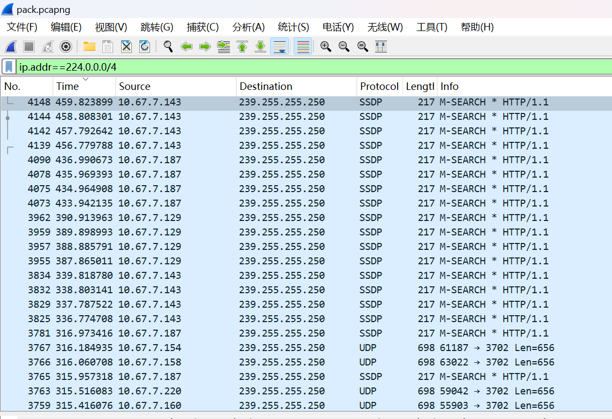

# 实验一 网络抓包—Ethernet

## 姓名：吴雪峰

## 学号：202212063020

## 实验日期：2024.4.14

## 一、实验目的：
1、掌握网络分析工具Wireshark的使用方法；
2、理解以太网的数据帧格式和MAC地址。

## 二、实验内容与分析

### 1.观察Frame信息，写出数据包的捕获时间，这个包与第一个包的相对时间增量，帧序号，数据包的长度，捕获的长度，协议封装层次。

捕获时间：Arrival Time: Apr  9, 2024 11:52:25.379140000 中国标准时间
相对时间增量：495.573714
帧序号：4334
长度：60bytes(480bits)
捕获长度：60bytes(480bits)
协议封装层次：eth:ethertype:arp

### 2.找到一个单播帧，分析其首部各字段值，并说明其含义，如发送计算机的MAC地址和接收计算机的MAC地址各是什么，以及类型字段等。

#### (1)版本（Version）：4
这个字段用于指示使用的IP协议版本，可能是IPv4或IPv6。
#### (2)首部长度（Header Length）：20
这个字段表示IPv4首部的长度，以32位字的长度为单位。
#### (3)区分服务（Differentiated Services Field）：0x00
这个字段用来获得更好的服务，指定特殊的数据包处理方式。
#### (4)总长度（Total Length）：40
这个字段指出首部和数据的总长度，以字节为单位。
#### (5)标识（Identification）：0x48f2
这个字段用于唯一标识发送的数据报，每发送一个数据报，计数器加一。
#### (6)标志（Flags）：0x02
这个字段中的最低位为1时表示后面还有分片的数据报，为0则表示这是最后一个数据片；中间一位为1表示不能分片，为0才允许分片。
#### (7)片偏移（Fragment Offset）：0
这个13位的字段表示较长的分组在经过通信链路中因分组过大进行分片时，分片在原分组中的相对位置，以8字节为偏移单位。
#### (8)生存时间（Time to Live）：128
这个字段表示数据报在网络中的最长生存时间，每经过一个路由器，该值减一。
#### (9)协议（Protocol）：TCP(6)
这个字段指示了传输层使用的协议，如TCP、UDP或其他。
#### (10)首部校验和（Header Checksum）：0x0000
这个字段用于检查IPv4首部数据的完整性。
#### (11)目标MAC地址（Destination MAC Address）：00:00:00:00:00:00
接收计算机的MAC地址。
#### (12)源MAC地址（Source MAC Address）：80:05:88:cb:22:cc
发送计算机的MAC地址。
#### (13)类型/长度（Type/Length）：0800
指示帧携带的数据类型，如0800代表携带的是IPv4数据包。

### 3.找到一个广播帧，源地址和目的地址是什么，数据部分承载的是什么协议的数据包？

源地址：169.254.40.207
目标地址：10.67.7.254
协议：IPv4

### 4.尝试编写过滤规则找到一个组播帧。

### 5.实验中捕获的所有以太网帧，最小帧长是多少？为什么？

过滤规则：eth
最小帧长：64
一个以太网帧包括多个部分，其中有目的MAC地址（6字节）、源MAC地址（6字节）、类型/长度字段（2字节）、有效载荷（也称为数据或负载，至少46字节）、填充（如果需要的话）以及帧校验序列（FCS，4字节）。为了确保冲突检测（CSMA/CD）的正确性，以太网规定了最小帧长为64字节。这个长度包括了所有必要的帧字段，以确保数据在网络中的可靠传输。

### 6.在实验中捕获的以太网帧中，除了封装IP数据包，还有别的什么协议的数据包？Type字段的值是多少？

ARP：Type字段的值为0x0806。
RARP：Type字段的值为0x8035
MPLS：Type字段的值为0x8848
VLAN：Type字段的值为0x8100。

## 三、实验总结

本次实验中对于wireshark的界面上的各个参数不清楚，通过利用AI工具和翻译工具解决了。
完成了实验目标。
收获了wireshark的部分基本使用方式。但是对于剩余功能和部分参数仍然存在不清楚。