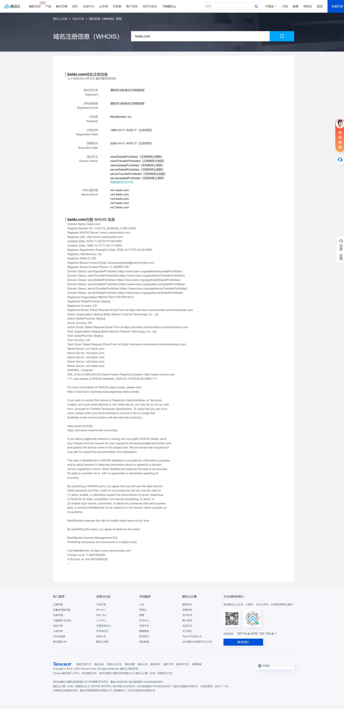
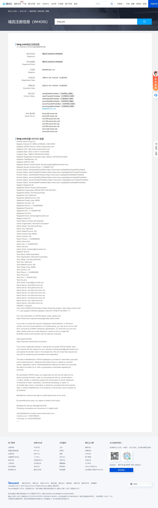
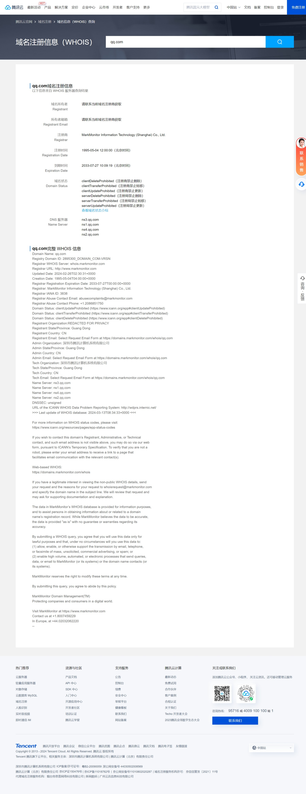
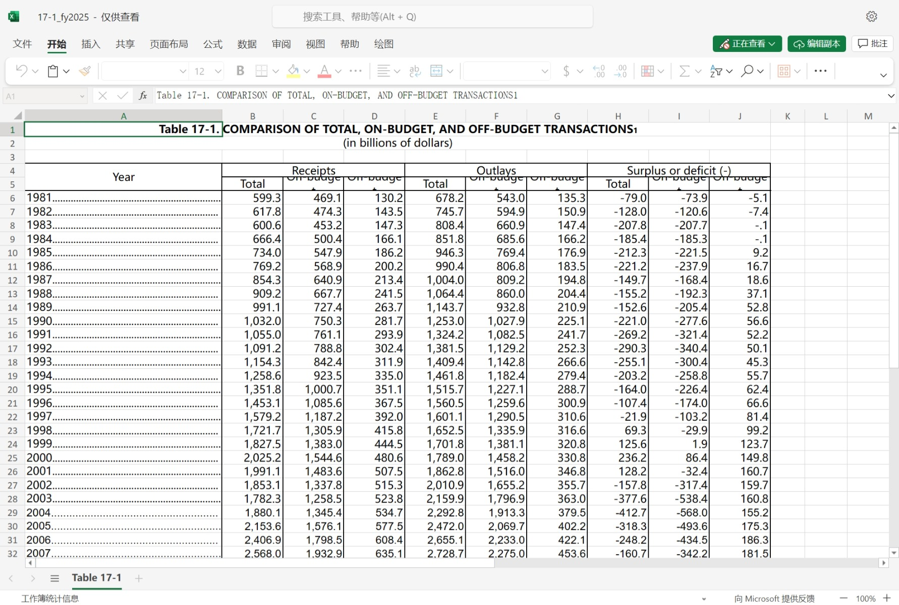
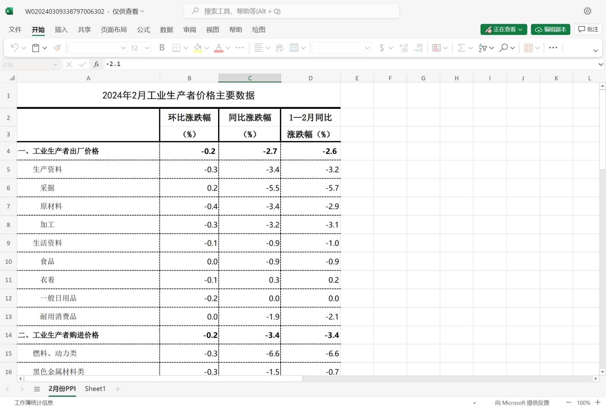
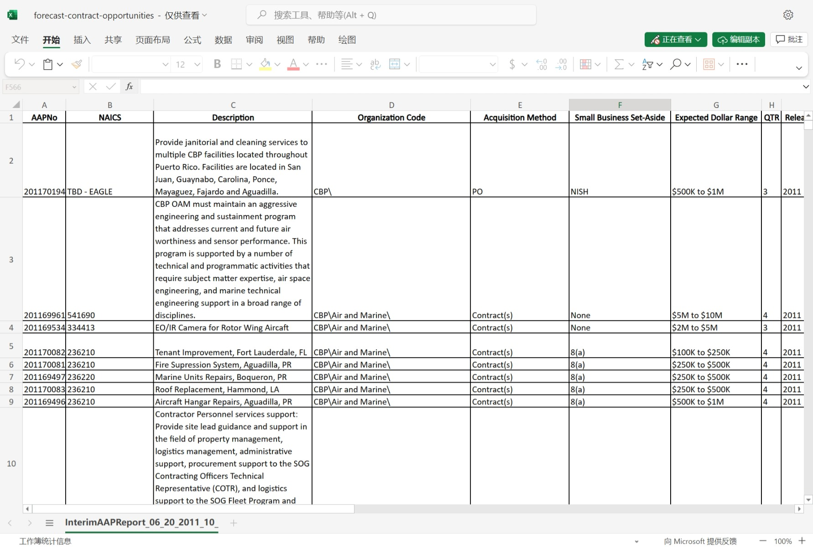
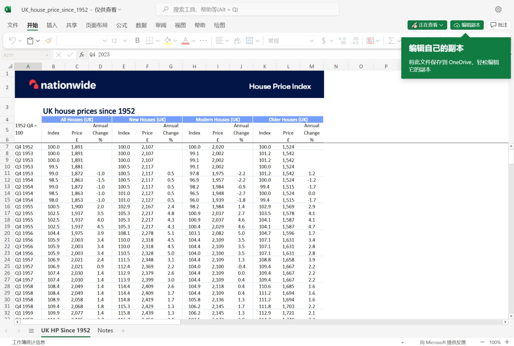
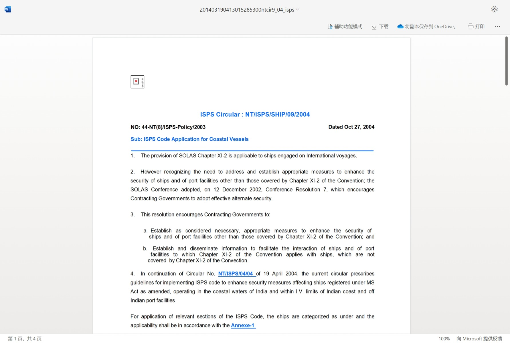

# 实验一

## 实战

## 思考一

1:WHOIS可以查询网站的域名所有者、所有者邮箱、注册商、注册时间和到期时间、域名状态和DNS服务器等信息。
2:可以通过域名劫持、类似域名注册攻击等方式进行篡改来盗取域的信息

# 实战二

## 实战

.png)
.png)

## 思考二

1.有A记录、AAAA记录、CNAME记录、NS记录、MX记录、TXT记录、PTR记录、SOA记录、SRV记录、URL转发 
其中包含的信息可能有：A记录（Address Record）：A记录将域名解析为IPv4地址。这是最常见的DNS记录类型，用于将主机名（例如：http://example.com）指向一个IPv4地址（例如：192.0.2.1）。
(1)、AAAA记录（IPv6 Address Record）：AAAA记录将域名解析为IPv6地址。与A记录类似，AAAA记录用于将主机名（例如：http://example.com）指向一个IPv6地址（例如：2001:0db8:85a3:0000:0000:8a2e:0370:7334）
(2)、CNAME记录（Canonical Name Record）：CNAME记录用于将一个域名指向另一个域名。通常用于别名或子域名的情况，例如将http://www.example.com指向http://example.com。/
(3)、MX记录（Mail Exchange Record）：MX记录用于指定处理域名电子邮件的邮件服务器。通常，MX记录会指向一个邮件服务器的域名，如：http://mail.example.com。
(4)、NS记录（Name Server Record）：NS记录指定了负责解析域名的DNS服务器。通常，在注册域名时，域名注册商会为您分配默认的NS记录。这些记录可以更改，以便将域名的解析委托给其他DNS服务器。
(5)、TXT记录（Text Record）：TXT记录用于存储与域名相关的任意文本信息。这些记录通常用于验证域名所有权（如Google网站验证）或实现电子邮件验证技术（如SPF，DKIM和DMARC）。/
(6)、SRV记录（Service Record）：SRV记录用于指定提供特定服务（如VoIP、IMAP、SMTP等）的服务器及其优先级和权重。这使得客户端能够根据SRV记录自动发现服务提供商的服务器地址和端口。/
(7)、PTR记录（Pointer Record）：PTR记录用于实现反向DNS查找，将IP地址解析为域名。这对于某些网络诊断工具和反垃圾邮件策略非常重要。
(8)、SOA记录（Start of Authority Record）：SOA记录包含关于DNS区域的基本信息，包括负责区域的主DNS服务器、区域管理员的联系信息、区域的序列号等。
(9)、NAPTR记录（Naming Authority Pointer Record）：NAPTR记录用于实现正则表达式基于的重写规则，以将一个域名转换为另一个域名。这种记录主要用于ENUM（电话号码映射）和其他URI映射技术

2..png)
.png)

3.上图中负责人字段提供了一个电子邮件地址，可以用作其他攻击的一部分，并且从当前的序列号来看，如果它是基于日期并定期检查的，则更改可能表明公司中的某些活动。
上图中TXT记录是文本信息，应始终检查是否有有价值的信息。这里的第一个泄露了显然与系统管理有关的人的电话号码和电子邮件地址。第二个显示该网站已通过验证，可在 Google Apps 帐户中使用。第三种是GoDaddy用来检查申请SSL证书的人是否拥有该域的一种方式，如果此类信息泄露了有关正在使用的服务或隶属关系的信息，则可能会很有用。

4：将AXFR传输禁用，并配置DNS服务器只接受来自受信任的源的AXFR请。也可以使用随机化的DNS响应来防止攻击者进行暴力枚举域名。定期更新您的DNS服务器软件，以确保其具有最新的安全功能

# 实验三

## 实战一

## 实战二

## 实战三

## 实战四

## 思考三

1.intitle：按标题搜索；
inurl：链接搜索返回那些网址url里面包含你指定关键词的页面；
site：指定域名；
filetype：指定文件类型；
intext：指定页面内容的关键词；
index of：以目录浏览的web网站；
phonebook：查询美国街道和电话号码；
Allinurl：此运算符在提到的 URL 上查找用户指定的字符，然后根据该特定字符返回结果；
Inanchor：此运算符定位链接上使用的确切锚文本；管道运算符 (|)：此运算符显示在其查询中包含一个或两个指定单词的所有网站。

2.
实例：
(1)、"PMB" AND ("changelog.txt" OR inurl:opac_css)，意为搜索txt格式且关键词包含“PMB”的页面。
(2)、intext:"user" filetype:php intext:"account" inurl:/admin意为查询网页内有“user”和“account”且格式为php的所有页面。
(3)、intitle:"phpinfo" site:*.com.* intext:"HTTP_HOST"意为查询网页内容包含“HTTP_HOST"且标题中有“phpinfo”的以.com.结尾的网站。
(4)、intext:"Reportico" site:.com OR site:.org OR site:.net OR site:.gov OR site:.edu意为在网页中有“Reportico”且网站尾缀是.com或者.org或.net或.gov或.edu的网站。
(5)、inurl:signup | inurl:sign-up | inurl:register | inurl:registration意为搜索网页url中包含“signup”或者“sign-up”或者“register”或“registration”的网页。

3.
(1)、查询网页url中含有“wp-content”且网页标题中含有“index.of”网页内容含有“wp-config。php”的网页：inurl:"wp-content" intitle:"index.of" intext:wp-config.php 
(2)、filetype:txt intitle:"Index of" intext:"php" site:*.com.*查询网页标题含有”Index of”且网页内容有“php”的尾缀是“*.com.*”的txt文件的网页 
(3)、intext:"user" filetype:php intext:"account" inurl:/admin查询网页url中含有/admin且网页内容含有“user”“account”的文件类型为php的网页。

4.
使用 Google 高级搜索语法：通过在 Google 搜索栏中使用特定的高级搜索语法，如 site、inurl、intitle、filetype 等，可以限定搜索结果范围，更精准地找到目标信息。利用漏洞测试工具：有些工具如 Shodan 和 Censys 可以帮助你搜索公开可见的漏洞和设备信息，这些工具可以帮助你快速定位潜在的漏洞目标。关注安全漏洞公告和 CVE 披露：定期关注安全漏洞公告和 CVE（通用漏洞和漏洞披露）数据库，了解最新的漏洞信息和修复建议。利用社交工程和情报收集：通过社交网络和其他渠道，收集目标公司或组织的信息，包括员工名单、技术架构、网络拓扑等，有助于更有针对性地进行 dorking 查找漏洞。定期进行安全审计：对自己的网站和系统进行定期的安全审计和漏洞扫描，及时修复发现的漏洞，避免被他人利用。