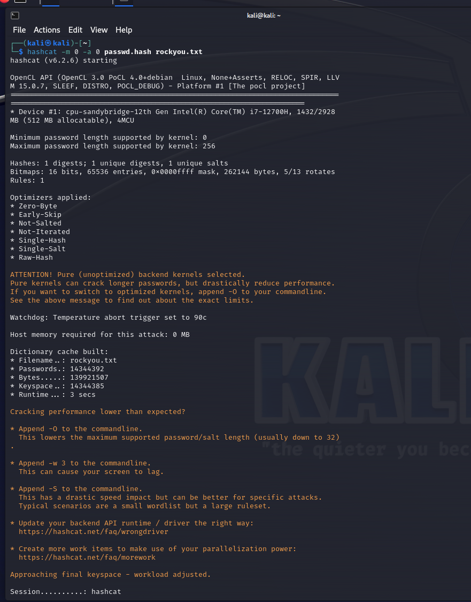
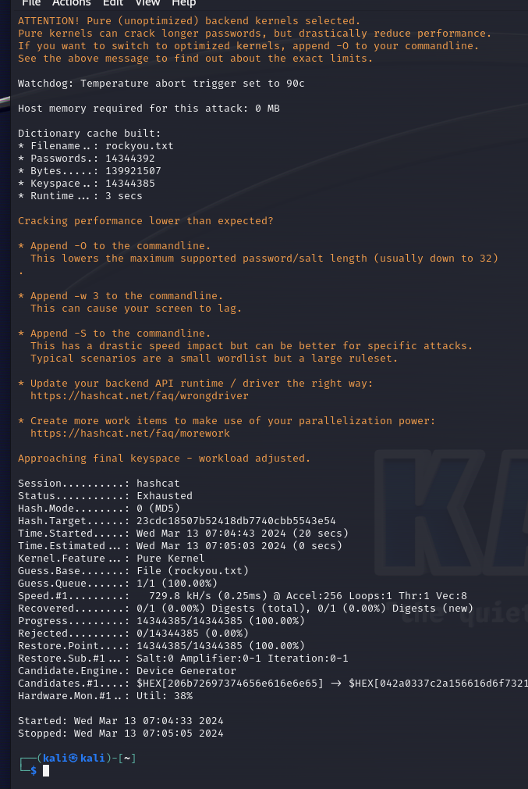
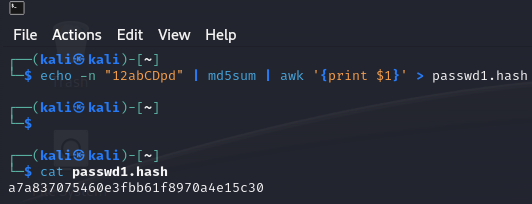
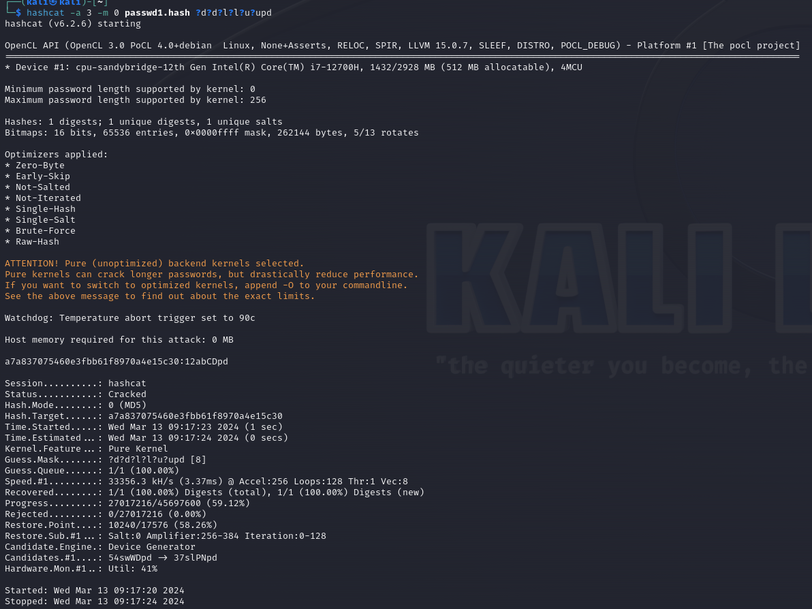
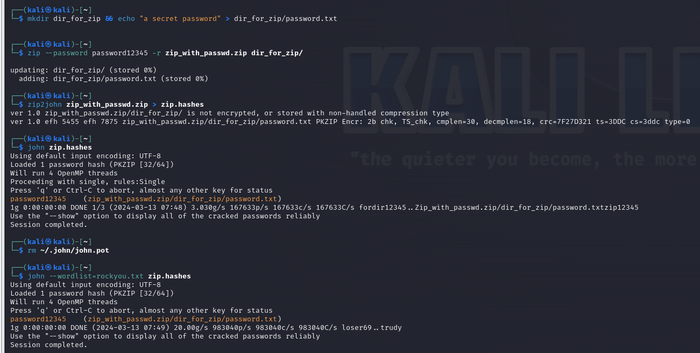
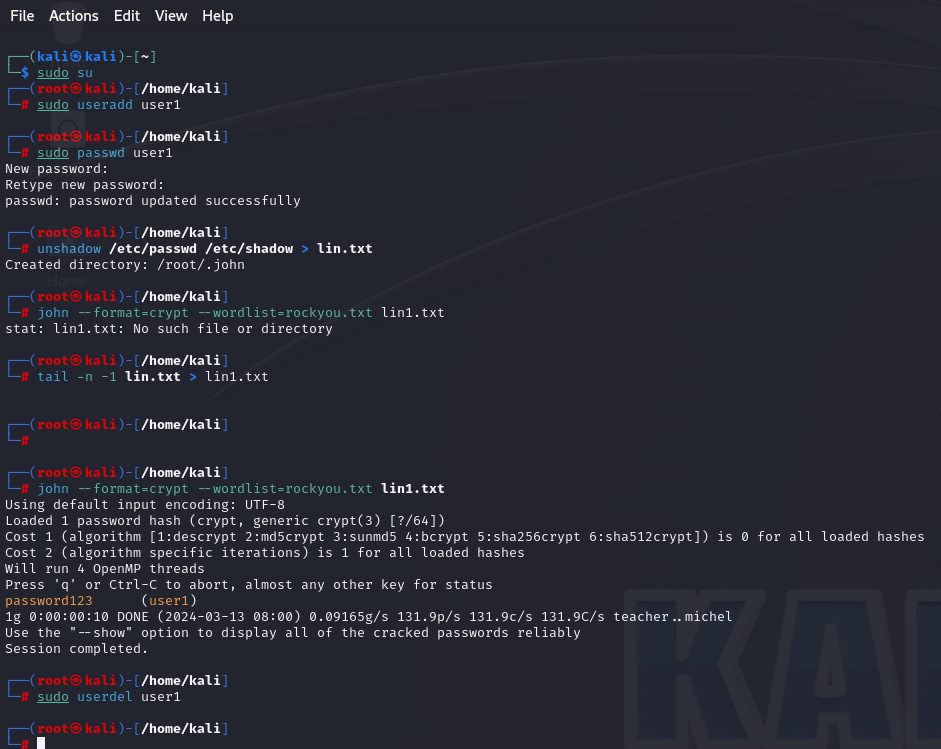

# 实验一

## 实战

## 思考一

1.
(1)wordlist:字典攻击，利用字典文件直接进行密码爆破。当知道密码可能包含的单词或词组时，可以使用字典攻击。
(2)wordlist+rules:结合了字典和暴力破解，通过使用字典中的口令与掩码字符的组合来生成新的密码尝试。当对密码的一部分有猜测，但需要试验不同的字符组合时，可以使用字典加掩码或掩码加字典的方式。
(3)Bruce-Force:尝试已经给定的字符集的各种组合，通过尝试所有可能的字符组合直到找到正确的密码，完全依赖于计算能力来穷举所有可能性。在没有足够信息指导密码猜测时，或者当其他更智能的攻击模式无效时，Bruce-Force攻击模式是最后的手段。
(4)Combinator:将多个字典混合进行尝试，将一个字典的内容与另一个字典的内容进行组合，生成新的密码尝试列表。这种方法可以在不进行完全暴力破解的情况下，大幅增加尝试的密码空间，提高破解效率。适合那些密码由不同部分组成的情况。通过合理地结合字典，能够在可接受的时间内尝试更多的密码组合，从而提高破解成功率。
2.
hashcat -m 0 -a 3 ?a?a?a?a?a
其中，?a表示未知的字符，若已知其类型，则可用?d表示数字、?l表示小写字母、?u表示大写字母、?s表示特殊字符、?c表示所有可打印字符。若有已知部分，则不需加?直接输入，如：若已知pd，则输入?cpd

# 实验二

## 1.

## 2.

## 思考二

1.创建一个包含所有8位数字排列的文本文档当作字典，其中必须一行一个。之后使用john the ripper的词表模式进行破解

2.使用增量破解，使用--pdf-crypt选项进行破解。
