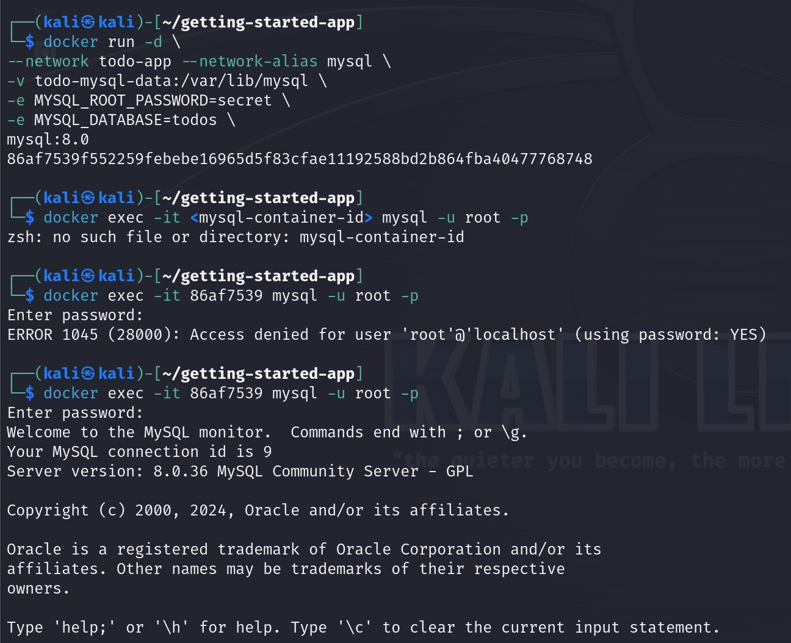
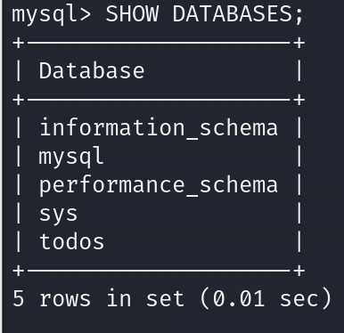
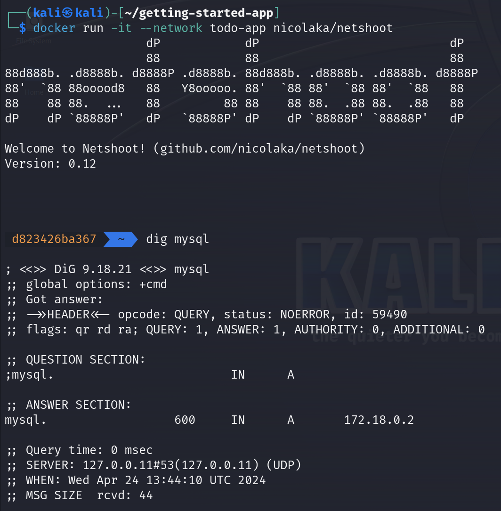
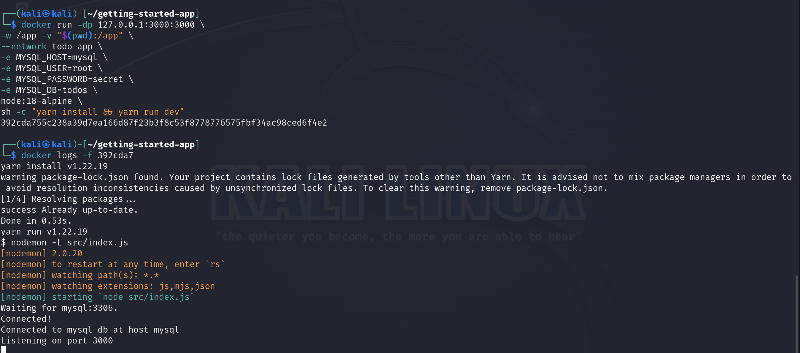
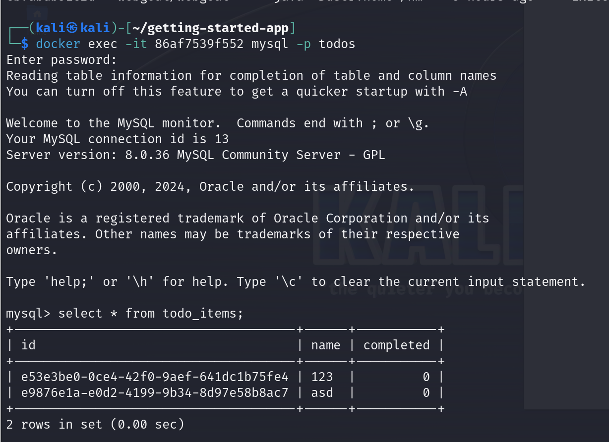
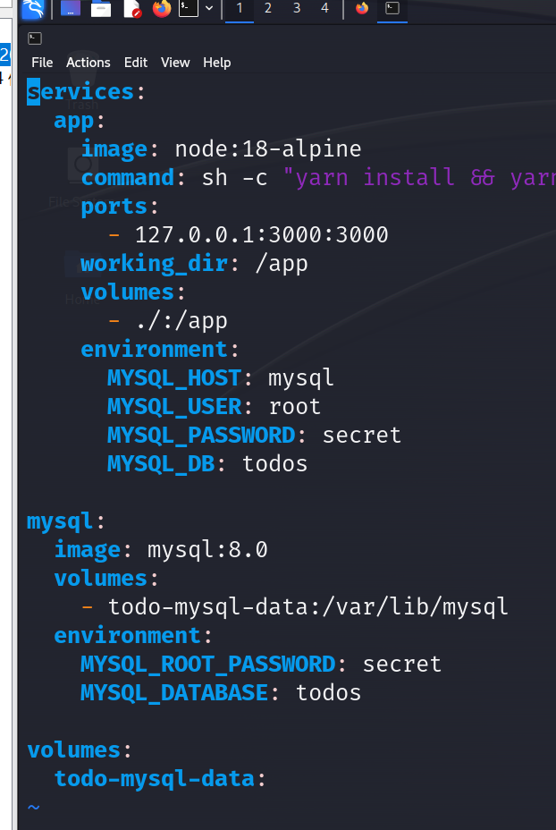
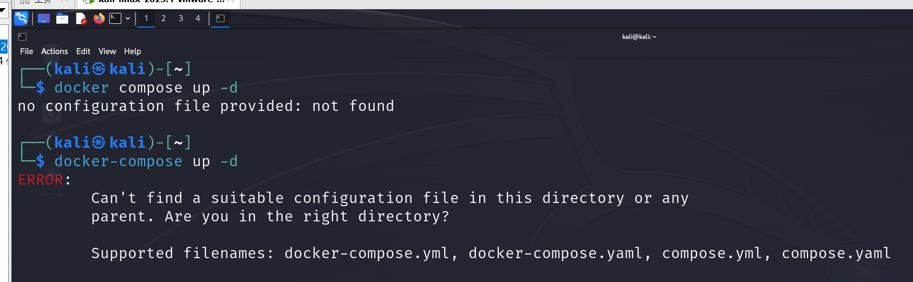

# 第三章：基于容器技术的渗透测试靶场环境构建

## 实验一：以 MySQL 为例使用容器网络

### 步骤一：启动MySQL

### 步骤二：连接 MySQL

### 步骤三：使 TODO 应用程序使用 MYSQL

## 实验二：使用 Docker Compose

### 步骤一：创建 Compose 文件

### 步骤二：使用 Docker Compose 定义应用服务

### 步骤三：使用 Docker Compose 定义 MySQL 服务

### 步骤四：运行应用程序堆栈

在运行docker compose命令时遇到了错误，难以解决

### 步骤五：关掉 Docker Compose