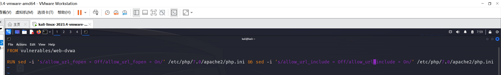
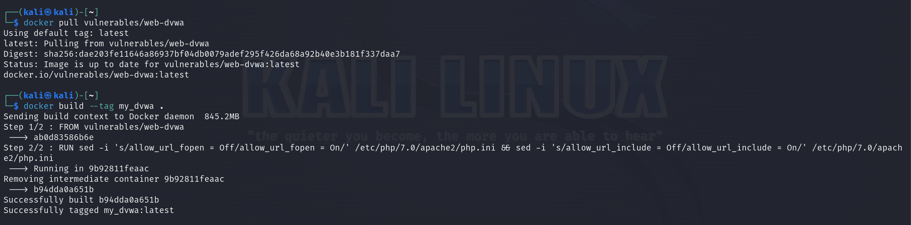
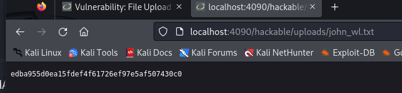
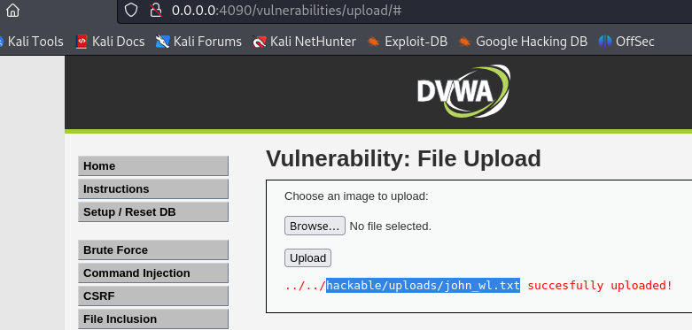
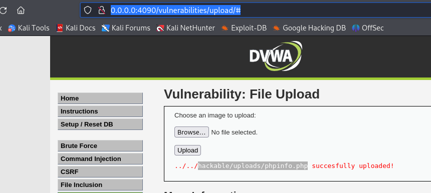
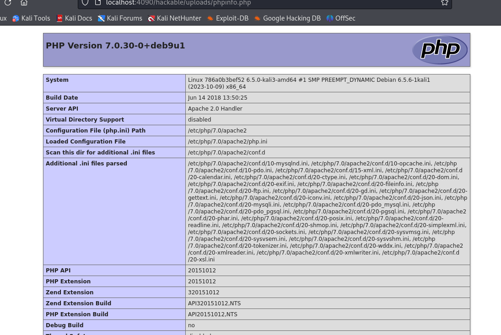
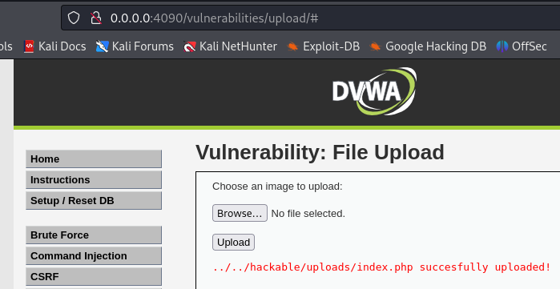
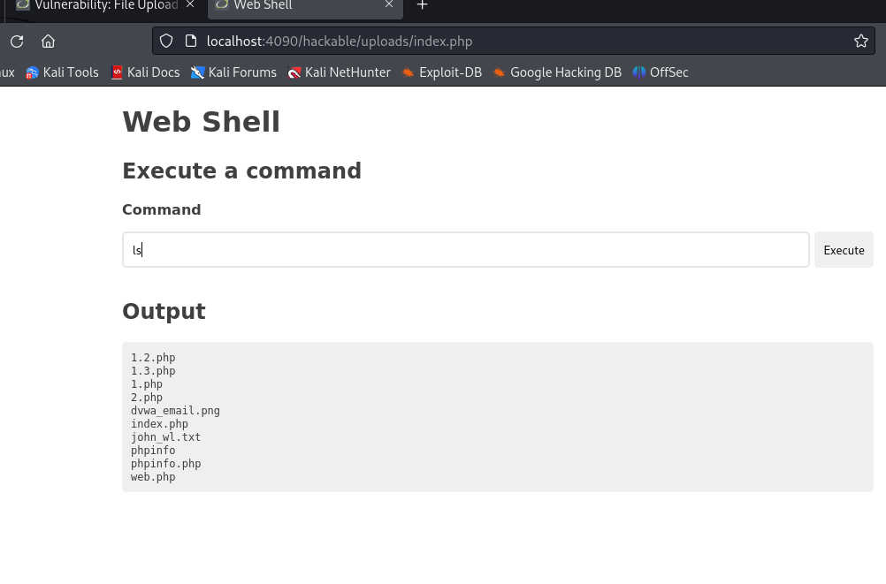
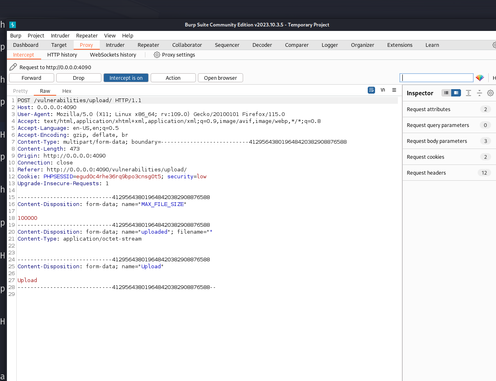
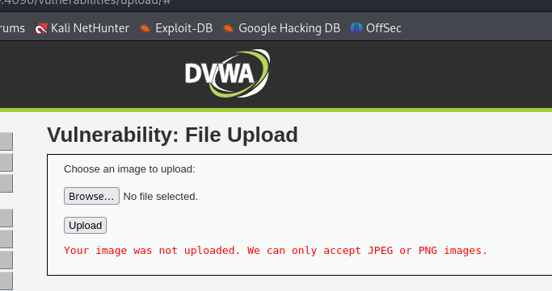

# 第四章：渗透测试靶场实战

## 安装DVWA靶场

1.创建dockerfile

2. 构建 DVWA 镜像及容器

## 实验一：DVWA - Vulnerability: File Upload - Low

### 步骤一

1. 尝试上传任意文件，使用其正常功能。

2. 尝试上传一个phpinfo文件，验证上传的phpinfo文件是否可执行。

3. 尝试上传一个 Web Shell 文件

### 步骤二：分析漏洞原因

1.文件上传漏洞：该代码没有对上传的文件进行任何验证或过滤。攻击者可以上传恶意文件，例如包含恶意代码的脚本文件（如PHP、JavaScript等），从而在服务器上执行恶意操作。
路径遍历漏洞：basename($_FILES['uploaded']['name'])函数用于获取上传文件的基本名称，但并未对文件名进行任何验证或过滤。攻击者可以通过构造特殊的文件名来绕过目录限制，访问服务器上的其他文件或目录。
2.权限问题：代码中的目标路径是固定的，并且未对上传文件的权限进行控制。攻击者可以上传具有高权限的文件，从而获得对服务器的完全控制权。
3.错误信息泄露：当文件上传失败时，代码会输出"Your image was not uploaded."的错误消息。这可能向攻击者提供了有关服务器配置和文件上传机制的信息。

### 步骤三：使用 Burpsuite 抓包查看通信流量

## 实验二：DVWA - Vulnerability: File Upload - Medium

### 步骤一
1. 尝试上传 Web Shell，发现上传失败。
2. 查看源码，查找过滤规则。发现对于文件类型做出了限制，要求必须是
"image/jpeg" 或者 "image/png"。

3. 在 Burpsuit 的 Repeater 中，将请求头中的 Content-Type: application/x-php
修改为 Content-Type: image/png，再次尝试发送上传 Web Shell 的请求。