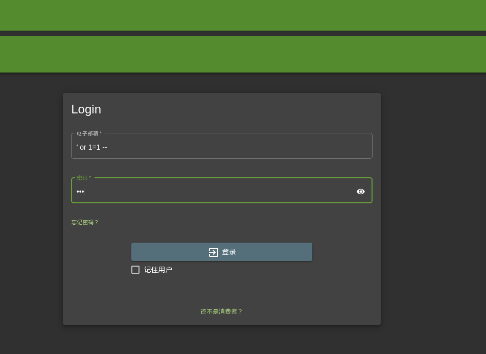
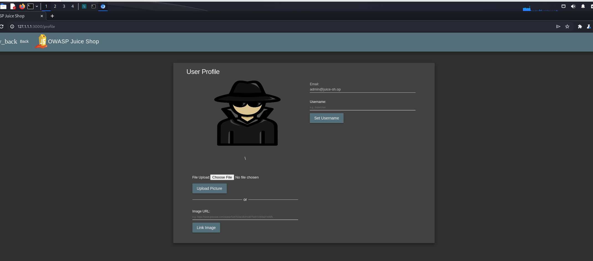
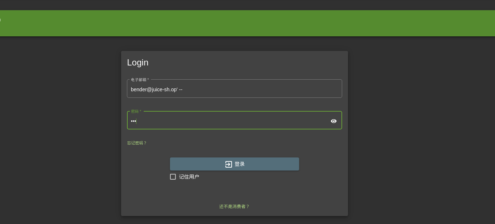
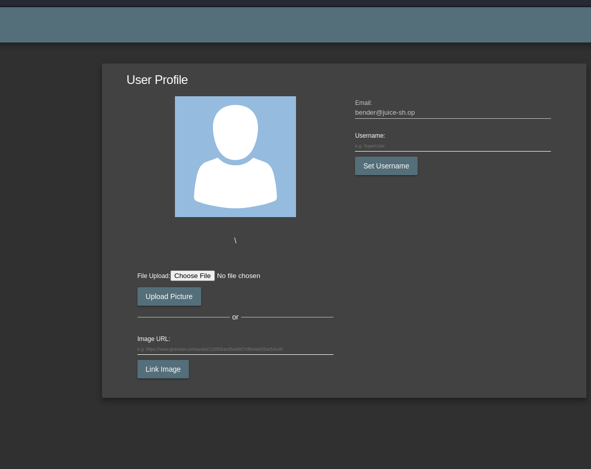

# 第五章：安全评估基础

## 实验一：对 Juice Shop 进行信息收集

### 问题 #1：管理员的电子邮件地址是什么？

admin@juice-sh.op

### 问题 #2：搜索使用了什么参数？

administration

### 问题 #3：Jim 在他的评论中提到了什么电视节目？

星际迷航

## 实验二：对 Juice Shop 进行注入

### 问题 #1：登录管理员帐户！

1.使用通用用户名' or 1=1 --
2.输入一个密码

### 问题 #2：登录 Bender 帐户！

1.访问localhost:3000/#/administration知晓bender的用户名是bender@juice-sh.op
2.输入用户名bender@juice-sh.op' --
3.输入任意密码

