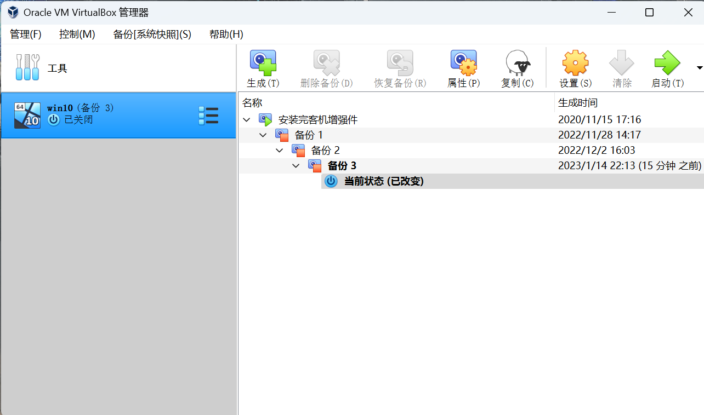
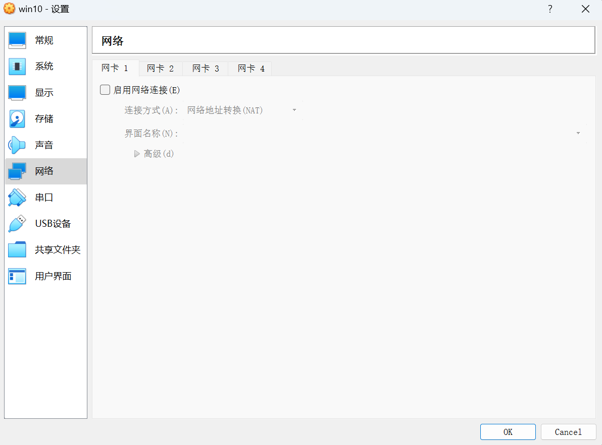
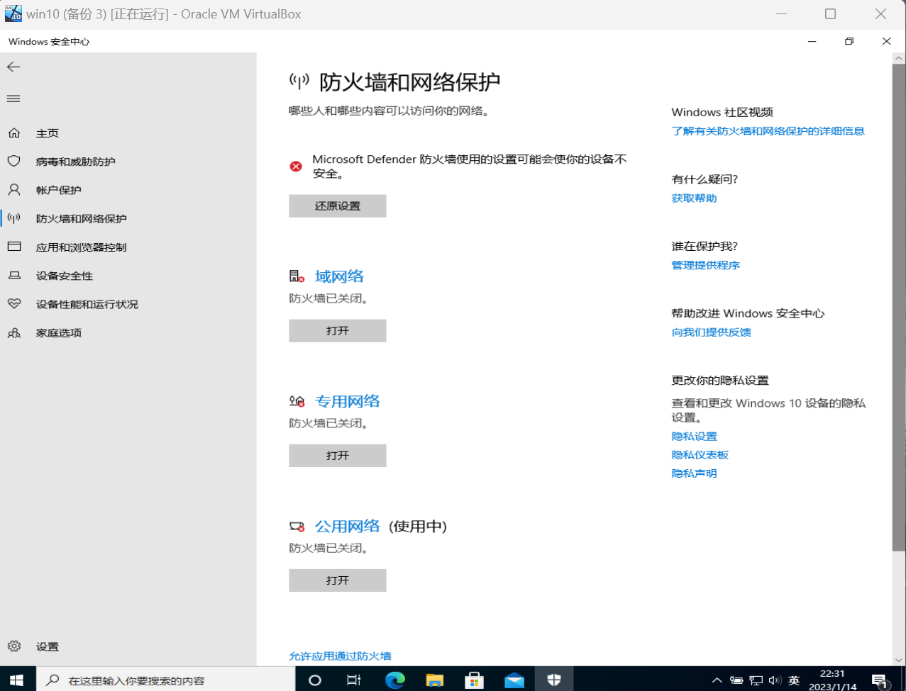
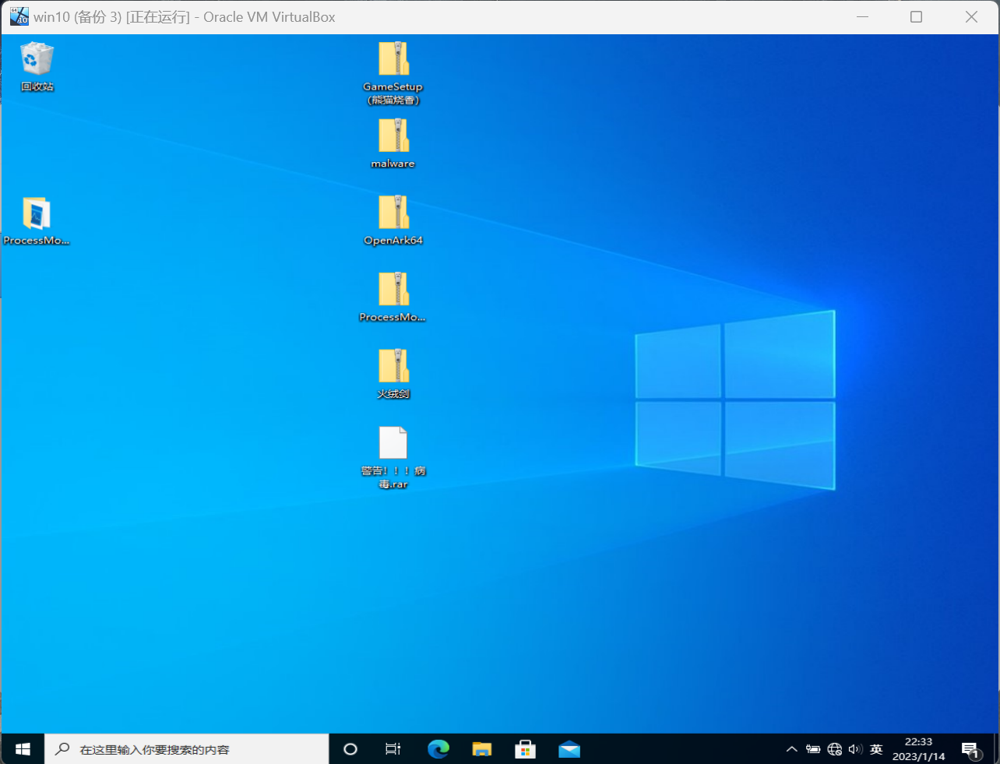
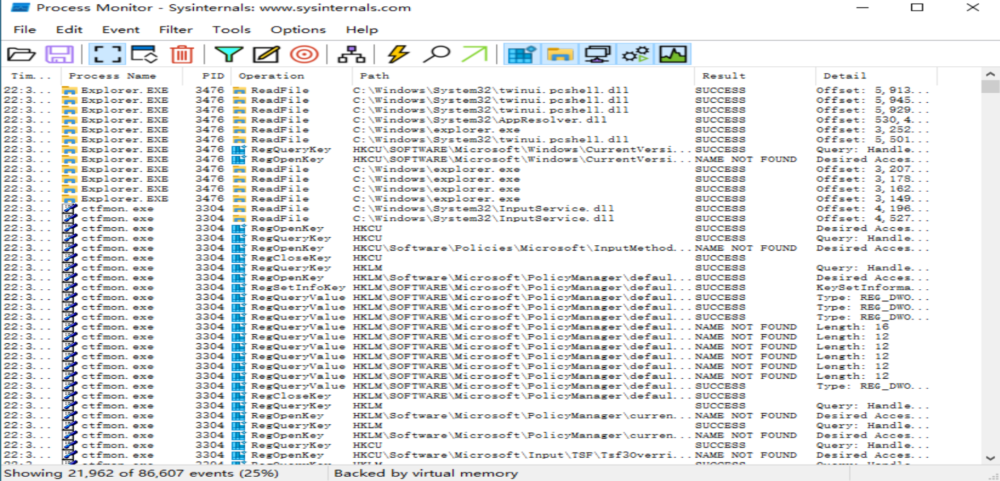
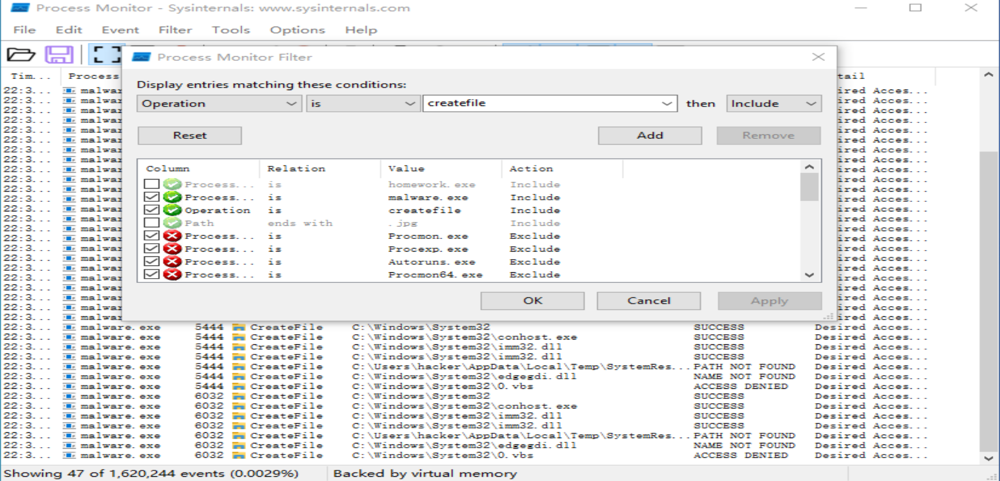
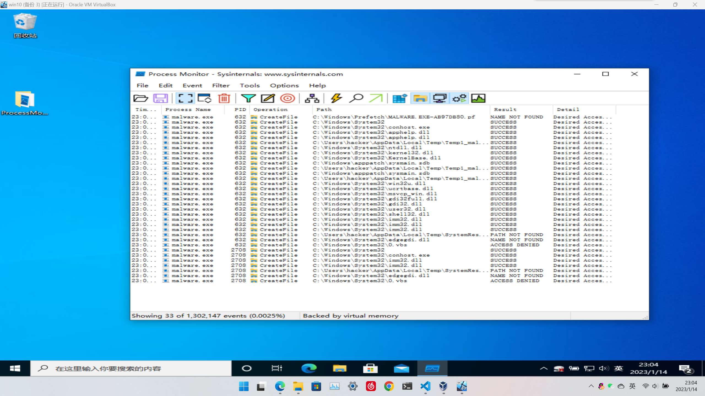

# save-your-disk
## 准备部分

1. 设置好虚拟机
2. 下载需要的文件
3. 做好备份
4. 关闭网络
5. 关闭防火墙
6. 放入要做的作业文件

## 开始

1. 在虚拟机中打开posess monitor
2. 打开malware.exe
3. 筛选进程名为malware.exe
4. 筛选行为为createfile的进程
5. 跳到写入文件的路径
6. 删除路径

## 过程截图

